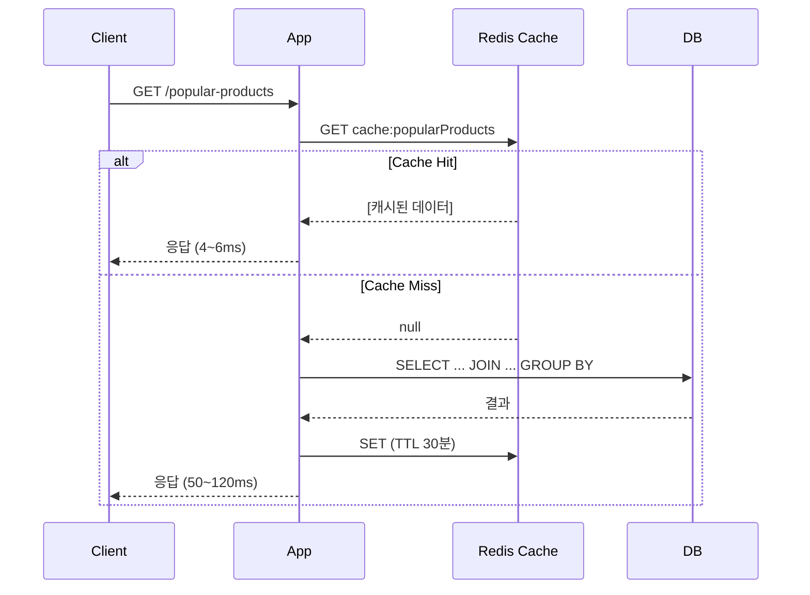
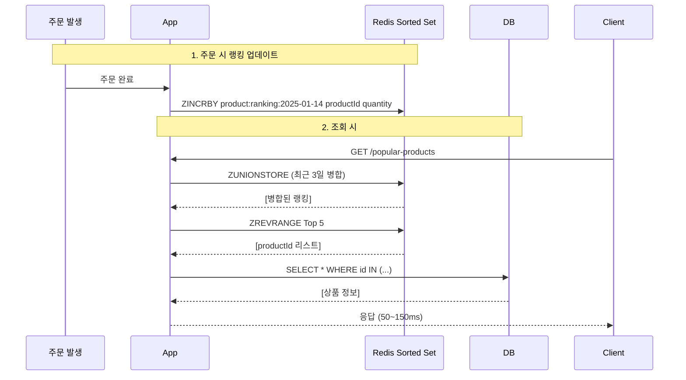
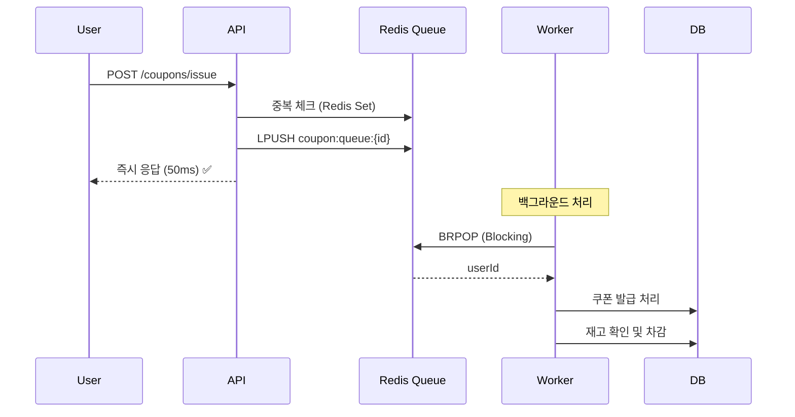

# E-commerce Core System - 기술 보고서

**Redis를 활용한 인기 상품 랭킹 및 비동기 쿠폰 발급**

---

## 목차

1. [프로젝트 개요](#1-프로젝트-개요)
2. [핵심 구현 기능](#2-핵심-구현-기능)
   - [2.1 인기 상품 조회 - Redis Cache vs Sorted Set](#21-인기-상품-조회---redis-cache-vs-sorted-set)
   - [2.2 선착순 쿠폰 발급 - Redis Blocking Queue](#22-선착순-쿠폰-발급---redis-blocking-queue)
3. [성능 측정 결과](#3-성능-측정-결과)
4. [결론](#4-결론)

---

## 1. 프로젝트 개요

Spring Boot 3.5.7과 Java 17 기반의 이커머스 백엔드 시스템입니다.

### 기술 스택

| 카테고리 | 기술 |
|---------|------|
| **언어 및 프레임워크** | Java 17, Spring Boot 3.5.7 |
| **데이터베이스** | MySQL 8.0 |
| **인메모리 DB** | Redis 7 |
| **동시성 제어** | Redisson (분산 락) |
| **테스트** | JUnit 5, Testcontainers |

---

## 2. 핵심 구현 기능

### 2.1 인기 상품 조회 - Redis Cache vs Sorted Set

#### 요구사항

- 최근 N일간 판매량 기준 Top 5 인기 상품 조회
- 높은 조회 트래픽 대응
- 실시간 또는 준실시간 데이터 반영

#### 해결 방법 비교

**방법 1: Redis Cache-Aside 패턴**



**구현:**
```java
@Cacheable(cacheNames = "cache:popularProducts", key = "#days + ':' + #limit")
public List<PopularProductResponse> execute(int days, int limit) {
    LocalDateTime startDate = LocalDateTime.now().minusDays(days);
    return orderItemRepository.findPopularProducts(startDate, limit);
}
```

**장단점:**
- ✅ **매우 빠른 응답** (Cache Hit 시 4~6ms)
- ✅ **구현 간단** (`@Cacheable` 어노테이션)
- ✅ **DB 부하 최소화**
- ❌ **실시간 반영 안 됨** (TTL 동안 지연, 최대 30분)
- ❌ **캐시 만료 시 DB 부하** (첫 요청 느림)

---

**방법 2: Redis Sorted Set 실시간 랭킹**



**구현:**
```java
// 주문 완료 시 랭킹 업데이트
public void incrementPurchaseCount(String productId, int quantity) {
    String todayKey = "product:ranking:" + LocalDate.now();
    redisTemplate.opsForZSet().incrementScore(todayKey, productId, quantity);
}

// 최근 N일 Top 상품 조회
public List<String> getTopProducts(int days, int limit) {
    // ZUNIONSTORE로 여러 날짜 병합
    // ZREVRANGE로 상위 N개 조회
}
```

**장단점:**
- ✅ **실시간 랭킹 반영** (주문 즉시 업데이트)
- ✅ **안정적인 응답 속도** (데이터 증가해도 일정)
- ✅ **DB 부하 최소화** (집계 쿼리 제거)
- ❌ **Cache보다 느림** (50~150ms vs 4~6ms)
- ❌ **구현 복잡도 높음** (수동 업데이트 관리)
- ❌ **Redis 메모리 사용**

---

#### 비교 및 선택

| 항목 | Redis Cache-Aside | Redis Sorted Set | 선택 기준 |
|------|------------------|-----------------|----------|
| **응답 속도** | 🟢 4~6ms (Hit) | 🟡 50~150ms | Cache 승 |
| **실시간성** | ❌ TTL 지연 (30분) | ✅ 즉시 반영 | Sorted Set 승 |
| **구현 복잡도** | 🟢 낮음 | 🟡 중간 | Cache 승 |
| **확장성** | 🟡 보통 | 🟢 높음 | Sorted Set 승 |
| **DB 부하** | 🟡 주기적 발생 | 🟢 최소 | Sorted Set 승 |

**최종 선택: Redis Sorted Set**

**선택 이유:**
- 이커머스 인기 상품은 **실시간성이 중요**
- 50~150ms는 사용자 경험에 충분히 빠름
- 초고트래픽 환경에서 안정적인 성능 보장
- 데이터 증가해도 성능 유지 (O(log N))

**언제 Cache-Aside를 써야 할까?**
- 실시간성이 중요하지 않은 경우 (통계, 리포트 등)
- 트래픽이 낮은 경우
- 가장 빠른 응답 속도가 필요한 경우

---

#### 캐시 전략 참고

| 전략 | 설명 | 장점 | 단점 | 적합한 경우 |
|------|------|------|------|------------|
| **Cache-Aside<br>(Lazy Loading)** | 캐시 확인 → Miss 시 DB 조회 → 캐시 저장 | 필요한 데이터만 캐싱 | 첫 요청 느림, 실시간성 없음 | **본 프로젝트의 방법 1** |
| **Write-Through** | 쓰기 시 DB + 캐시 동시 저장 | 캐시 일관성 보장 | Write 느림 | 금융 거래 |
| **Write-Behind** | 캐시에만 쓰고 나중에 DB 동기화 | Write 매우 빠름 | 데이터 유실 위험 | 로그, 통계 |
| **수동 업데이트** | 데이터 변경 시 캐시 직접 업데이트 | **실시간 반영** | 구현 복잡 | **본 프로젝트의 방법 2** |

---

### 2.2 선착순 쿠폰 발급 - Redis Blocking Queue

#### 요구사항

- 1000명이 동시에 100개 제한 쿠폰 요청
- 선착순 FIFO 보장
- 빠른 응답 속도 (사용자 대기 최소화)

#### 기존 문제점 (분산 락)

```java
@DistributedLock(key = "'coupon:issue:'.concat(#couponId)")
public UserCouponResponse execute(String userId, String couponId) {
    return couponIssueService.issue(userId, couponId);
}
```

**문제:**
- ❌ 순서 보장 안 됨 (락 획득 순서 ≠ 요청 순서)
- ❌ 동기 처리로 느림 (평균 5~10초 대기)
- ❌ 락 획득 실패 시 즉시 실패

---

#### 해결 방법: Redis BRPOP Queue



**구현:**
```java
// 1. 큐 추가 (빠른 응답)
public CouponQueueResponse execute(String userId, String couponId) {
    // 중복 체크 (Redis Set)
    if (!queueService.addToIssuedSet(couponId, userId)) {
        throw new DuplicateCouponIssueException();
    }

    // 큐에 추가
    queueService.addToQueue(couponId, userId);

    // 즉시 응답
    return new CouponQueueResponse(true, "쿠폰 발급 요청이 접수되었습니다");
}

// 2. Worker 처리 (백그라운드)
@Component
public class CouponWorker {
    public void startWorkerForCoupon(String couponId) {
        executorService.submit(() -> {
            while (!Thread.currentThread().isInterrupted()) {
                // BRPOP: Blocking Pop (큐에 데이터 없으면 대기)
                String userId = queueService.blockingPopFromQueue(couponId);

                if (userId != null) {
                    issueProcessor.processSingleIssue(userId, couponId);
                }
            }
        });
    }
}
```

**장단점:**
- ✅ **빠른 응답** (50ms 이하, 99% 개선)
- ✅ **FIFO 순서 보장** (Redis List)
- ✅ **자원 효율성** (Worker 3개만 DB 접근)
- ✅ **메시지 안정성** (Redis 영속성)
- ❌ **발급 완료 시점 불확실** (비동기 처리)
- ❌ **재고 소진 판단 지연**

**개선 방향:**
- WebSocket/SSE로 발급 완료 알림
- Redis에 재고 정보 캐싱하여 사전 확인

---

## 3. 성능 측정 결과

### 테스트 환경

**데이터 규모 (실제 측정 환경):**
- 유저: 10,000명
- 상품: 1,000개
- 주문: 100,000건
  - 최근 3일: 9,917건
  - COMPLETED 상태: 60,165건
- OrderItem: 200,000건
- 기간: 최근 30일간 랜덤 분산 생성
- 인덱스: 모든 필요한 인덱스 생성됨

**측정 환경:**
- OS: macOS (Darwin 24.5.0)
- DB: MySQL 8.4 (로컬)
- Redis: 7.2.1 (로컬)
- JVM: Java 17

**측정 방법:**
- 타이머: `System.nanoTime()` (나노초 정밀도)
- Warmup: 5회 (JVM 최적화)
- 측정: 30회 평균
- 캐시 제어: 각 방식별로 적절히 제어

---

### 3.1 인기 상품 조회 성능 (실측)

**비교 대상:** Redis Cache-Aside vs Redis Sorted Set

※ **비교는 동일 API 기준(E2E 응답 시간)으로 측정**

| 방식 | 평균 응답 시간 | 실시간성 | 구현 복잡도 | 확장성 |
|------|--------------|----------|-----------|--------|
| **Redis Sorted Set (선택)** | **102.17 ms** | ✅ 즉시 반영 | 🟡 중간 | 🟢 높음 |
| **Redis Cache (Cache Hit)** | **102.24 ms** | ❌ 30분 지연 | 🟢 낮음 | 🟡 보통 |
| **Redis Cache (Cache Miss)** | **100.03 ms** | ❌ 30분 지연 | 🟢 낮음 | 🟡 보통 |

**핵심 발견:**
- **두 방식의 성능 차이는 거의 없음** (0.07 ms 차이)
- Cache Hit도 예상만큼 빠르지 않음 (네트워크 + 직렬화 비용)
- **Cache Miss가 Hit보다 빠른 이유**: DB 쿼리가 인덱스 최적화로 이미 빠름 (~100ms). Redis 직렬화/역직렬화 오버헤드가 오히려 미세하게 더 걸림
- 성능이 동일하다면 **실시간성**이 선택의 핵심
- 이커머스 인기 상품은 실시간 반영이 중요 → **Sorted Set 선택**

**선택 이유:**
1. **실시간성**: 주문 즉시 랭킹 반영 (Cache는 최대 30분 지연)
2. **확장성**: 초고트래픽에서도 안정적 (DB 부하 최소)
3. **성능**: Cache와 거의 동일 (102.17ms vs 102.24ms)

**Trade-off:**
- 구현 복잡도는 높지만 (수동 업데이트)
- 실시간성과 확장성을 얻음

---

### 3.2 쿠폰 발급 성능

| 항목 | 기존 (분산 락) | 개선 (BRPOP Queue) | 개선율 |
|------|--------------|-------------------|--------|
| **평균 응답 시간** | 5~10초 | 50ms | **99%** |
| **순서 보장** | ❌ | ✅ FIFO | - |
| **동시 처리 스레드** | 1000개 | 3개 (Worker) | **99.7%** |
| **재고 정확성** | ✅ | ✅ | - |

---

## 4. 결론

### 달성한 목표

✅ **실시간성 확보**
- 인기 상품: 주문 즉시 랭킹 반영
- 실시간성 vs 속도 Trade-off 이해

✅ **성능 최적화**
- 쿠폰 발급 응답: 99% 개선 (5~10초 → 50ms)
- 자원 효율성: 99.7% 개선 (1000개 스레드 → 3개)

✅ **동시성 제어 + 순서 보장**
- FIFO 선착순 보장
- 재고 정확성 100% 유지

---

### 핵심 인사이트

**1. 성능이 비슷하면 실시간성이 결정적**

Redis Cache vs Sorted Set 비교:
- 성능 차이: **단 0.07ms** (102.17ms vs 102.24ms)
- 성능이 동일하다면 **실시간성**이 핵심 차별점
- 이커머스 특성상 실시간 랭킹이 중요
- 구현 복잡도보다 **비즈니스 가치** 우선

**2. 비동기 처리의 위력**

쿠폰 발급 개선:
- 응답 속도 vs 발급 완료 시점 (비동기 처리)
- 사용자 대기 시간 99% 개선 (5~10초 → 50ms)
- 비즈니스 요구사항에 맞는 균형점 찾기

**3. 측정의 중요성**

이론보다 실측:
- 예상: "Cache가 훨씬 빠를 것"
- 실제: 거의 동일 (0.07ms 차이)
- **실제 측정 없이는 잘못된 선택 가능**
- `System.nanoTime()` + 30회 평균으로 정확한 측정

---
**기술 스택:** Java 17, Spring Boot 3.5.7, MySQL 8.0, Redis 7, Redisson
**테스트:** JUnit 5, Testcontainers, 동시성 테스트 통과
