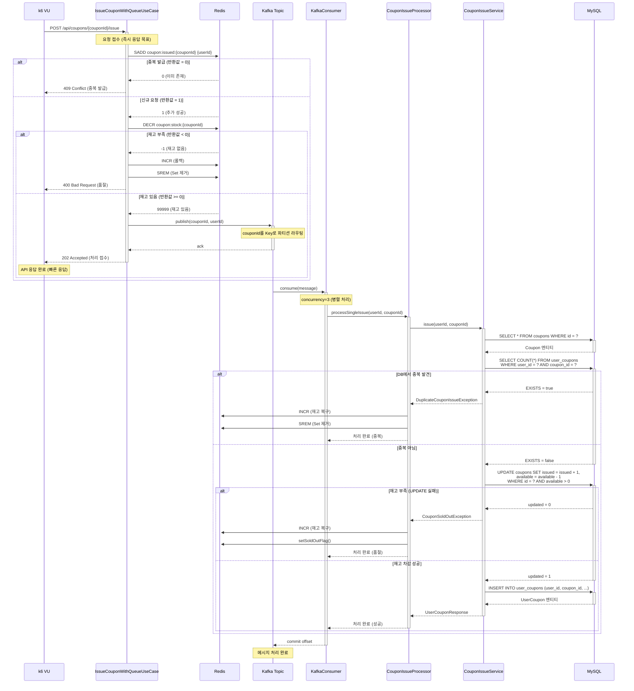
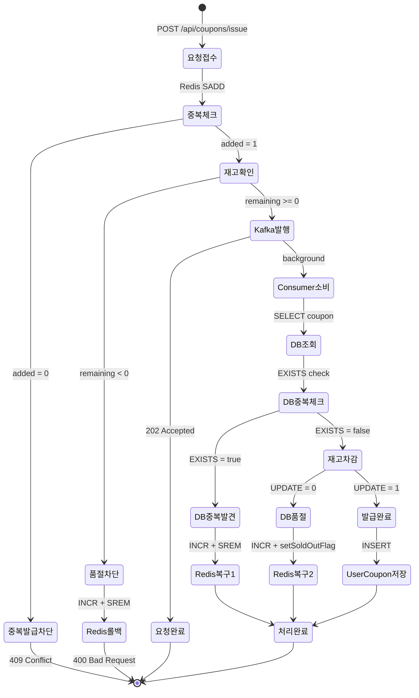
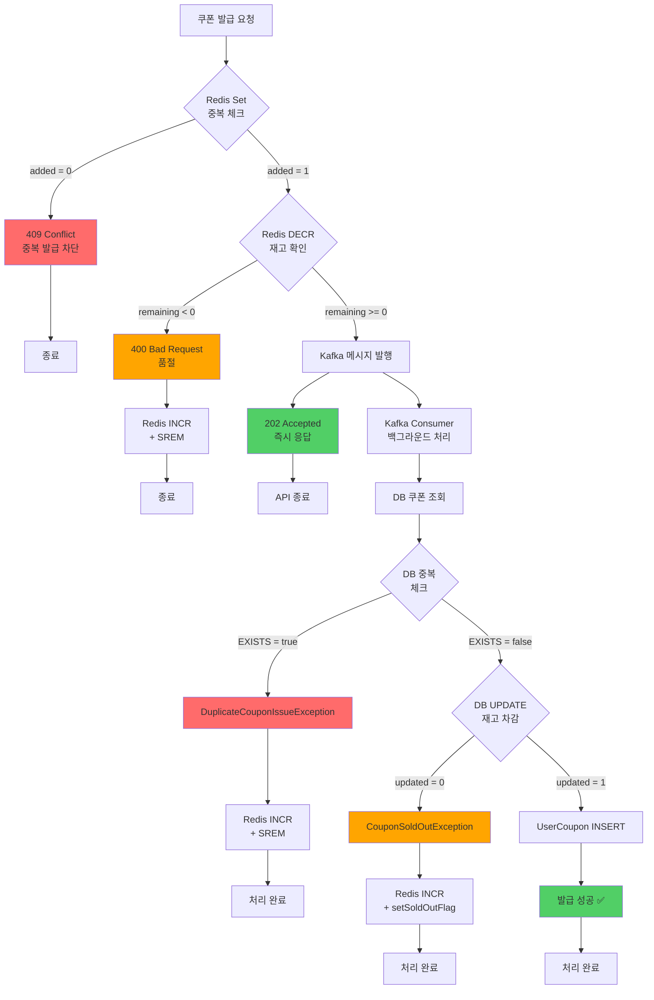

# 쿠폰 발급 시스템 부하 테스트 보고서

## 📋 목차
1. [개요](#개요)
2. [시스템 아키텍처](#시스템-아키텍처)
3. [동시성 제어 전략](#동시성-제어-전략)
4. [쿠폰 발급 프로세스 플로우](#쿠폰-발급-프로세스-플로우)
5. [k6 부하 테스트 설계](#k6-부하-테스트-설계)
6. [테스트 시나리오](#테스트-시나리오)
7. [성능 메트릭](#성능-메트릭)
8. [기술적 의사결정](#기술적-의사결정)
9. [병목 및 최적화](#병목-및-최적화)

---

## 개요

### 테스트 목적
- **선착순 쿠폰 발급** 시 대규모 동시 요청에 대한 시스템 안정성 검증
- **Redis 분산 락 + Kafka 비동기 처리** 성능 측정
- **중복 발급 방지** 및 **재고 정합성** 로직 검증
- 실제 이벤트 상황(폭주 트래픽) 시뮬레이션

### 테스트 환경
- **Tool**: k6 (부하 테스트 도구)
- **Backend**: Spring Boot 3.5.7 + Java 17
- **Database**: MySQL (JPA)
- **Cache/Lock**: Redis
- **Message Queue**: Apache Kafka
- **Test Data**: 150,000명의 테스트 사용자 (`test-user-1` ~ `test-user-150000`)
- **쿠폰 재고**: 100,000개 (`test-coupon-1`)

---

## 시스템 아키텍처

### 전체 구조

```
┌─────────────┐
│   k6 VUs    │ ──(1) POST /api/coupons/{couponId}/issue
│ (최대 500개) │
└─────────────┘
       │
       ▼
┌──────────────────────────────────────────────────────┐
│                 Spring Boot API                       │
│  ┌────────────────────────────────────────────────┐  │
│  │  IssueCouponWithQueueUseCase                   │  │
│  │  (API Layer - 빠른 응답 202 Accepted)           │  │
│  └────────────────────────────────────────────────┘  │
└──────────────────────────────────────────────────────┘
       │
       ├─(2)─► Redis Set (중복 체크)
       │       coupon:issued:{couponId}
       │       SADD → 0이면 중복, 1이면 통과
       │
       ├─(3)─► Redis Counter (재고 감소)
       │       coupon:stock:{couponId}
       │       DECR → 음수면 품절
       │
       └─(4)─► Kafka Topic: coupon-issue-request
               (couponId를 Key로 파티션 라우팅)
                       │
                       ▼
              ┌─────────────────┐
              │ Kafka Partitions │
              │  P0  │  P1  │ P2 │
              └─────────────────┘
                 │      │      │
          ┌──────┴──────┴──────┴───────┐
          │   Kafka Consumer (3개)     │
          │   concurrency = 3          │
          └────────────────────────────┘
                       │
                       ▼
              ┌──────────────────────────┐
              │ CouponIssueProcessor     │
              │ (트랜잭션 처리)           │
              └──────────────────────────┘
                       │
                       ├─(5)─► DB SELECT (쿠폰 조회)
                       ├─(6)─► DB SELECT (중복 체크)
                       ├─(7)─► DB UPDATE (재고 차감)
                       │       UPDATE coupons SET issued = issued + 1
                       │       WHERE id = ? AND available > 0
                       └─(8)─► DB INSERT (UserCoupon 발급)
```

### 레이어별 역할

| 레이어 | 클래스 | 역할 | 트랜잭션 |
|--------|--------|------|----------|
| **API** | `IssueCouponWithQueueUseCase` | 요청 접수 및 빠른 응답 (202 Accepted) | ❌ |
| **Cache** | `CouponIssueRedisService` | 중복 체크 (Set) + 재고 관리 (Counter) | ❌ |
| **MQ Producer** | `CouponKafkaProducer` | Kafka 메시지 발행 | ❌ |
| **MQ Consumer** | `CouponKafkaConsumer` | Kafka 메시지 소비 (concurrency=3) | ❌ |
| **Transaction** | `CouponIssueProcessor` | 예외 처리 및 트랜잭션 조율 | ✅ |
| **Business** | `CouponIssueService` | 실제 쿠폰 발급 로직 (DB 작업) | ✅ (내부) |

---

## 동시성 제어 전략

### 3단계 동시성 제어

#### 1단계: Redis Set (중복 발급 방지)
```redis
SADD coupon:issued:test-coupon-1 test-user-12345
# 반환값: 1 (신규 추가) → 통과
# 반환값: 0 (이미 존재) → 409 Conflict 응답
```

- **목적**: 같은 사용자가 중복 요청 시 빠른 차단
- **위치**: API 요청 시점 (즉시 응답)
- **원자성**: Redis SADD 명령은 원자적 연산

#### 2단계: Redis Counter (재고 관리)
```redis
DECR coupon:stock:test-coupon-1
# 반환값: 99999 (재고 있음) → Kafka 발행
# 반환값: -1 (재고 없음) → 400 Bad Request 응답 + 롤백
```

- **목적**: 선착순 재고 관리 (빠른 판단)
- **위치**: API 요청 시점
- **원자성**: Redis DECR 명령은 원자적 연산
- **롤백**: 재고 부족 시 `INCR`로 복구 + Set에서 제거

#### 3단계: DB 원자적 UPDATE (최종 정합성)
```sql
UPDATE coupons
SET issued = issued + 1, available = available - 1
WHERE id = 'test-coupon-1'
  AND available > 0;  -- 재고가 있을 때만 차감
```

- **목적**: DB 레벨 최종 정합성 보장
- **위치**: Kafka Consumer (백그라운드 처리)
- **원자성**: `WHERE available > 0` 조건으로 음수 재고 방지
- **반환값**: `updated = 0`이면 품절 예외

### Redis vs DB 정합성 관리

| 시나리오 | Redis 상태 | DB 상태 | 처리 |
|----------|-----------|---------|------|
| 정상 발급 | DECR 성공 | UPDATE 성공 | ✅ 발급 완료 |
| Redis 품절 | DECR → -1 | 미실행 | ❌ 400 응답 + Redis INCR |
| DB 품절 | DECR 성공 | UPDATE 실패 | ❌ Redis INCR + Set 제거 |
| 중복 발급 | Set 추가 실패 | 미실행 | ❌ 409 응답 |
| DB 중복 체크 | DECR 성공 | EXISTS = true | ❌ Redis INCR + Set 제거 |

---

## 쿠폰 발급 프로세스 플로우

### 전체 시퀀스 다이어그램



### 상태 전이 다이어그램



### 예외 처리 플로우



---

## k6 부하 테스트 설계

### 테스트 파일 구조

```
k6-tests/
├── coupon-issue-test.js              # 메인 테스트 (3개 시나리오 통합)
├── coupon-issue-sequential-test.js   # Sequential 전용
└── coupon-issue-random-test.js       # Random/Peak 전용
```

### 사용자 ID 생성 전략

#### 1. Sequential Test (고유 ID 보장)
```javascript
function getSequentialUserId() {
  const vuId = exec.vu.idInTest;  // VU ID (1~200)
  const iter = exec.scenario.iterationInInstance;  // iteration (0~249)

  // VU 1, iter 0: test-user-1
  // VU 1, iter 249: test-user-250
  // VU 2, iter 0: test-user-251
  // VU 200, iter 249: test-user-50000
  const uniqueId = (vuId - 1) * 250 + iter + 1;

  return `test-user-${uniqueId}`;
}
```

- **목적**: 중복 에러 0건 보장 (정합성 검증)
- **범위**: `test-user-1` ~ `test-user-50000`
- **특징**: 각 VU가 고유한 ID 범위 할당받음

#### 2. Random Test (실제 사용 패턴)
```javascript
function getRandomUserId() {
  const randomNum = Math.floor(Math.random() * 100000) + 50001;
  return `test-user-${randomNum}`;
}
```

- **목적**: 실제 사용자 행동 재현 (재시도, 중복 시도)
- **범위**: `test-user-50001` ~ `test-user-150000`
- **특징**: 중복 시도 발생 가능 (409 Conflict 예상)

---

## 테스트 시나리오

### 시나리오 1: Sequential Test (정합성 검증)

```javascript
{
  executor: 'per-vu-iterations',
  vus: 200,
  iterations: 250,  // 200 x 250 = 50,000 요청
  maxDuration: '10m'
}
```

| 항목 | 값 | 설명 |
|------|-----|------|
| **VUs** | 200 | 가상 사용자 200명 |
| **Iterations** | 250 (per VU) | 각 VU가 250번씩 실행 |
| **총 요청** | 50,000건 | 200 x 250 |
| **사용자 ID** | Sequential (고유) | test-user-1 ~ 50000 |
| **Sleep** | 없음 | 순수 성능 측정 |
| **목적** | 중복 에러 0건 검증 | 동시성 제어 정확도 |

#### 예상 결과
- ✅ 성공 (202/200): 50,000건
- ✅ 중복 에러 (409): **0건** (고유 ID이므로)
- ❌ 품절 (400): 0건 (재고 100,000개 > 50,000건)
- ❌ 시스템 에러 (5xx): 0% 목표

### 시나리오 2: Load Test (일반 부하)

```javascript
{
  executor: 'ramping-vus',
  stages: [
    { duration: '1m', target: 100 },
    { duration: '3m', target: 200 },
    { duration: '2m', target: 200 },
    { duration: '30s', target: 0 },
  ],
  startTime: '10m5s'
}
```

| 항목 | 값 | 설명 |
|------|-----|------|
| **VUs** | 0 → 100 → 200 | 점진적 증가 |
| **Duration** | 6분 30초 | 총 소요 시간 |
| **사용자 ID** | Random | test-user-50001 ~ 150000 |
| **Sleep** | 1~3초 | 사용자 행동 시뮬레이션 |
| **총 요청** | ~100,000건 (예상) | VU당 평균 500건 |

#### 예상 결과
- ✅ 성공: ~30% (나머지 재고 50,000개 소진)
- ⚠️ 중복 에러 (409): 발생 가능 (정상)
- ⚠️ 품절 (400): 재고 소진 후 발생
- ❌ 시스템 에러 (5xx): 0% 목표

### 시나리오 3: Peak Test (폭주 상황)

```javascript
{
  executor: 'ramping-vus',
  stages: [
    { duration: '30s', target: 300 },
    { duration: '1m', target: 500 },
    { duration: '2m', target: 500 },
    { duration: '30s', target: 0 },
  ],
  startTime: '16m40s'
}
```

| 항목 | 값 | 설명 |
|------|-----|------|
| **VUs** | 0 → 300 → 500 | 급격한 트래픽 증가 |
| **Duration** | 4분 | 짧은 기간 고부하 |
| **사용자 ID** | Random | test-user-50001 ~ 150000 |
| **Sleep** | 0.1초 | 거의 대기 없음 |
| **총 요청** | ~200,000건 (예상) | 이미 재고 소진 상태 |

#### 예상 결과
- ❌ 성공: 0건 (재고 이미 소진)
- ⚠️ 품절 (400): 대부분 (정상)
- ⚠️ 중복 에러 (409): 일부 발생
- ❌ 시스템 에러 (5xx): **0% 목표** (중요!)

---

## 성능 메트릭

### A) 상태 코드별 분류

```javascript
const status200Count = new Counter('status_200');  // 동기 발급 성공
const status202Count = new Counter('status_202');  // 비동기 접수 (Kafka)
const status400Count = new Counter('status_400');  // 품절
const status409Count = new Counter('status_409');  // 중복 발급
const status500Count = new Counter('status_500');  // 시스템 에러
```

### B) 비즈니스 결과별 Rate

```javascript
const successRate = new Rate('success_rate');           // 성공 (202/200)
const bizSoldOutRate = new Rate('biz_soldout_rate');    // 품절 (정상 차단)
const bizDuplicateRate = new Rate('biz_duplicate_rate'); // 중복 차단 (정상)
const systemErrorRate = new Rate('system_error_rate');   // 시스템 에러 (5xx)
```

### C) 결과별 Latency

```javascript
const latencySuccess = new Trend('latency_success');       // 성공 케이스 응답 시간
const latencySoldOut = new Trend('latency_soldout');       // 품절 케이스 응답 시간
const latencyDuplicate = new Trend('latency_duplicate');   // 중복 케이스 응답 시간
const latencySystemError = new Trend('latency_system_error'); // 에러 케이스 응답 시간
```

### Threshold (임계값)

```javascript
thresholds: {
  http_req_duration: ['p(95)<1000', 'p(99)<2000'],  // p95 < 1초, p99 < 2초
  http_req_failed: ['rate<0.1'],                    // 실패율 10% 미만
  errors: ['rate<0.05'],                            // 에러율 5% 미만
}
```

---

## 기술적 의사결정

### 1. 왜 Redis + Kafka를 선택했는가?

#### Redis (분산 락 + 재고 관리)
| 장점 | 이유 |
|------|------|
| **빠른 응답 속도** | 중복 체크 + 재고 확인을 밀리초 단위로 처리 |
| **원자적 연산** | SADD, DECR 명령이 원자적으로 동작 |
| **확장성** | Redis Cluster로 수평 확장 가능 |

```java
// Redis Set (중복 체크)
Long added = redisTemplate.opsForSet().add(issuedSetKey, userId);

// Redis Counter (재고 감소)
Long remaining = redisTemplate.opsForValue().decrement(stockKey);
```

#### Kafka (메시지 큐)
| 장점 | 이유 |
|------|------|
| **순서 보장** | 파티션 내에서 메시지 순서 보장 |
| **병렬 처리** | 3개 파티션 → 3개 Consumer 병렬 처리 |
| **메시지 영속성** | Disk 기반 저장 (재시작 시 복구 가능) |
| **백프레셔 처리** | Consumer 속도에 맞춰 처리 (서버 과부하 방지) |

```java
// couponId를 Key로 파티션 라우팅
kafkaTemplate.send(TOPIC, couponId, message);
```

### 2. 왜 분산 락을 사용하지 않았는가?

#### 기존 방식 (Redisson 분산 락)
```java
RLock lock = redissonClient.getLock("coupon-issue:" + couponId);
try {
    lock.lock(5, TimeUnit.SECONDS);
    // 쿠폰 발급 처리
} finally {
    lock.unlock();
}
```

| 단점 | 이유 |
|------|------|
| **응답 속도 저하** | 락 획득 대기 시간 발생 |
| **경합 (Contention)** | 동시 요청 시 락 경합으로 성능 저하 |
| **복잡도 증가** | 락 타임아웃, 데드락 처리 필요 |

#### 개선된 방식 (Redis Set + Kafka)
```java
// 1. 즉시 응답 (락 대기 없음)
Long added = redisService.addToIssuedSet(couponId, userId);

// 2. Kafka로 비동기 처리
kafkaProducer.publishCouponIssueRequest(couponId, userId);

return new CouponQueueResponse(true, "접수되었습니다", 0L);
```

| 장점 | 이유 |
|------|------|
| **빠른 응답 (< 50ms)** | 락 대기 없이 즉시 응답 |
| **높은 처리량** | Kafka가 초당 수만 건 처리 |
| **확장성** | 파티션 추가로 수평 확장 가능 |

### 3. Redis-DB 정합성 불일치 해결

#### 문제 상황
```
Time   │ Redis                │ DB
───────┼─────────────────────┼──────────────
T1     │ DECR → 99999         │ (미실행)
T2     │ (Kafka 지연)          │ (미실행)
T3     │ -                    │ UPDATE 실패 (재고 없음)
```

#### 해결 방법: 3단계 롤백
```java
try {
    couponIssueService.issue(userId, couponId);
} catch (CouponSoldOutException e) {
    // 1. Redis 재고 복구
    redisService.incrementStock(couponId);

    // 2. Redis Set 제거 (재시도 가능)
    redisService.removeFromIssuedSet(couponId, userId);

    // 3. 품절 플래그 설정 (빠른 차단)
    redisService.setSoldOutFlag(couponId);
}
```

---

## 병목 및 최적화

### 병목 분석 포인트

#### 1. Redis 재고 확인 성능
```javascript
// k6 메트릭에서 확인
latency_success (p95) < 100ms  // Redis 캐시 히트
latency_soldout (p95) < 50ms   // 품절 플래그로 빠른 응답
```

**최적화**:
- `coupon:sold-out:{couponId}` 플래그로 품절 후 빠른 차단
- Redis Set 조회는 O(1) 시간 복잡도

#### 2. Kafka Consumer 처리 속도
```yaml
# application.yml
spring:
  kafka:
    listener:
      concurrency: 3  # 파티션 수와 동일하게 설정
```

**최적화**:
- Consumer 수 = 파티션 수 (3개)
- 각 Consumer가 독립적으로 병렬 처리
- 파티션별 순서 보장 유지

#### 3. DB UPDATE 쿼리 성능
```sql
-- 원자적 UPDATE (인덱스 활용)
UPDATE coupons
SET issued = issued + 1, available = available - 1
WHERE id = ? AND available > 0;

-- 인덱스
CREATE INDEX idx_coupon_id ON coupons(id);
```

**최적화**:
- WHERE 조건에 인덱스 컬럼 사용 (`id`)
- `available > 0` 조건으로 음수 재고 방지

#### 4. DB 중복 체크 성능
```sql
-- 복합 인덱스 활용
SELECT COUNT(*) FROM user_coupons
WHERE user_id = ? AND coupon_id = ?;

-- 인덱스
CREATE UNIQUE INDEX idx_user_coupon
ON user_coupons(user_id, coupon_id);
```

**최적화**:
- 복합 유니크 인덱스로 중복 체크
- `existsByUserIdAndCouponId()` 사용

### 예상 TPS (Throughput)

| 구간 | VUs | 예상 TPS | 설명 |
|------|-----|----------|------|
| Sequential | 200 | 800~1000 | 대기 없이 연속 요청 |
| Load Test | 100~200 | 100~200 | Sleep 1~3초 |
| Peak Test | 500 | 1500~2000 | Sleep 0.1초 (폭주) |

---

## 결론

### 테스트 성공 기준

| 메트릭 | 목표 | 설명 |
|--------|------|------|
| **시스템 에러율** | 0% | 5xx 에러 없음 |
| **Sequential 중복 에러** | 0건 | 고유 ID → 중복 없어야 정상 |
| **응답 시간 (p95)** | < 1초 | API 응답 속도 |
| **Kafka 메시지 손실** | 0건 | 모든 메시지 처리 완료 |
| **재고 정합성** | 100% | Redis-DB 재고 일치 |

### 검증 항목

#### ✅ 동시성 제어
- [ ] Redis Set으로 중복 발급 차단 확인
- [ ] Redis DECR로 재고 관리 확인
- [ ] DB UPDATE 실패 시 Redis 롤백 확인

#### ✅ 성능
- [ ] p95 응답 시간 < 1초
- [ ] TPS 1000+ 달성
- [ ] 5xx 에러 0% 유지

#### ✅ 정합성
- [ ] Sequential 테스트에서 중복 에러 0건
- [ ] Redis 재고 = DB 재고 (테스트 종료 후)
- [ ] 발급된 쿠폰 수 = 100,000개 정확히

---

## 실행 방법

### 1. 테스트 데이터 준비

```bash
# Spring Boot 애플리케이션 실행 후
# LoadTestDataSeeder 실행 (자동 실행 설정 시)
# 또는 수동 실행:
curl -X POST http://localhost:8081/api/test/seed
```

### 2. Redis 재고 초기화

```bash
# Redis CLI에서 실행
redis-cli SET coupon:stock:test-coupon-1 100000
```

### 3. k6 테스트 실행

```bash
# 메인 테스트 (3개 시나리오 통합)
k6 run k6-tests/coupon-issue-test.js

# 환경 변수 설정
k6 run \
  -e BASE_URL=http://localhost:8081 \
  -e COUPON_ID=test-coupon-1 \
  k6-tests/coupon-issue-test.js

# 결과 저장
k6 run --out json=summary.json k6-tests/coupon-issue-test.js
```

### 4. 결과 확인

```bash
# 쿠폰 재고 확인
curl http://localhost:8081/api/coupons/test-coupon-1

# Redis 재고 확인
redis-cli GET coupon:stock:test-coupon-1

# 발급된 쿠폰 수 확인
mysql> SELECT COUNT(*) FROM user_coupons WHERE coupon_id = 'test-coupon-1';
```

---

## 참고 자료

### 관련 파일
- k6 테스트: `k6-tests/coupon-issue-test.js`
- UseCase: `IssueCouponWithQueueUseCase.java`
- Redis 서비스: `CouponIssueRedisService.java`
- Kafka Producer: `CouponKafkaProducer.java`
- Kafka Consumer: `CouponKafkaConsumer.java`
- Processor: `CouponIssueProcessor.java`
- Business Logic: `CouponIssueService.java`

### 핵심 개념
- **선착순 쿠폰**: 재고 한정, 빠른 사용자가 우선
- **분산 시스템**: Redis, Kafka, MySQL 조합
- **동시성 제어**: Redis 원자적 연산 + Kafka 순서 보장
- **비동기 처리**: 빠른 응답 + 백그라운드 처리
- **정합성 보장**: 3단계 롤백 메커니즘

---

**작성일**: 2026-01-11
**작성자**: Claude Code
**버전**: 1.0
