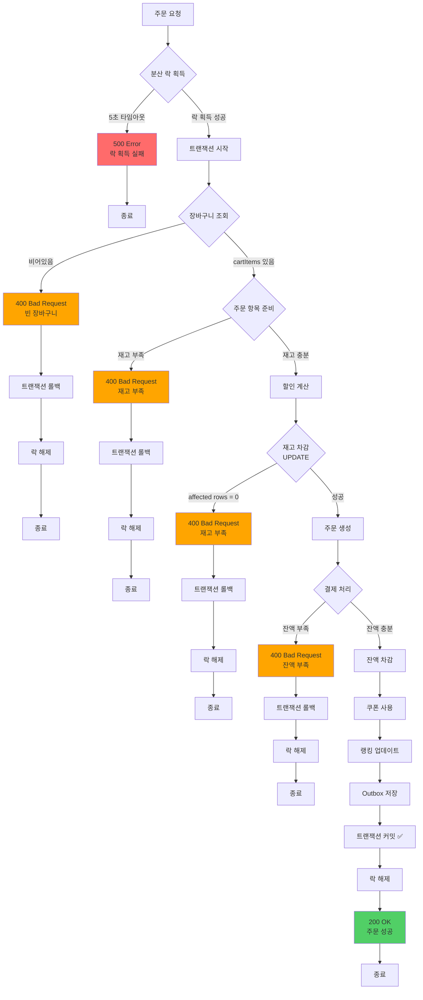

# 주문/결제 시스템 부하 테스트 보고서

## 📋 목차
1. [개요](#개요)
2. [시스템 아키텍처](#시스템-아키텍처)
3. [동시성 제어 전략](#동시성-제어-전략)
4. [주문/결제 프로세스 플로우](#주문결제-프로세스-플로우)
5. [k6 부하 테스트 설계](#k6-부하-테스트-설계)
6. [테스트 시나리오](#테스트-시나리오)
7. [성능 메트릭](#성능-메트릭)
8. [기술적 의사결정](#기술적-의사결정)
9. [병목 및 최적화](#병목-및-최적화)
10. [테스트 결과 분석](#테스트-결과-분석)

---

## 개요

### 테스트 목적
- **대규모 동시 주문 요청** 시 시스템 안정성 검증
- **Redisson 분산 락** 기반 동시성 제어 성능 측정
- **재고 차감 정합성** 검증 (동시 주문 시 재고 음수 방지)
- **잔액 결제 처리** 성능 및 정확도 측정
- **실제 이커머스 트래픽** 시뮬레이션

### 테스트 환경
- **Tool**: k6 (부하 테스트 도구)
- **Backend**: Spring Boot 3.5.7 + Java 17
- **Database**: MySQL (JPA)
- **Cache/Lock**: Redis (Redisson 분산 락)
- **Message Queue**: Apache Kafka (Outbox Pattern)
- **Test Data**:
  - 사용자: 150,000명 (`test-user-1` ~ `test-user-150000`)
  - 상품: 10개 (`test-product-1` ~ `test-product-10`)
  - 각 상품 재고: 10,000개
  - 각 사용자 잔액: 1,000,000원

---

## 시스템 아키텍처

### 전체 구조

```
┌─────────────┐
│   k6 VUs    │ ──(1) POST /api/orders
│ (최대 100개) │     { userId, couponId? }
└─────────────┘
       │
       ▼
┌──────────────────────────────────────────────────────┐
│                 Spring Boot API                       │
│  ┌────────────────────────────────────────────────┐  │
│  │  OrderController                               │  │
│  │  ↓                                             │  │
│  │  CreateOrderUseCase                            │  │
│  │  @DistributedLock(key = "order:user:{userId}") │  │ ← Redisson 분산 락
│  │  - 락 대기 시간: 5초                            │  │
│  │  - 락 보유 시간: 3초                            │  │
│  └────────────────────────────────────────────────┘  │
└──────────────────────────────────────────────────────┘
       │
       │ (2) 락 획득 후 진행
       ▼
┌──────────────────────────────────────────────────────┐
│          CreateOrderService (트랜잭션 시작)           │
│  ↓                                                   │
│  OrderFacade (주문 생성 흐름 조율)                     │
└──────────────────────────────────────────────────────┘
       │
       ├─(3)─► 장바구니 조회 (Cart + CartItems)
       │
       ├─(4)─► 상품 정보 조회 및 재고 확인
       │       OrderItemPreparationService
       │       - Product 조회 (일반 SELECT)
       │       - 재고 충분성 확인
       │
       ├─(5)─► 쿠폰 할인 계산
       │       OrderDiscountCalculator
       │       - UserCoupon 조회
       │       - 할인 금액 계산
       │
       ├─(6)─► 재고 차감 (원자적 UPDATE)
       │       ┌──────────────────────────────┐
       │       │ UPDATE products              │
       │       │ SET quantity = quantity - ?  │
       │       │ WHERE id = ?                 │
       │       │   AND quantity >= ?          │ ← DB 레벨 재고 검증
       │       └──────────────────────────────┘
       │       affected rows = 0 → 재고 부족 예외
       │
       ├─(7)─► 주문 엔티티 생성
       │       Order + OrderItems INSERT
       │
       ├─(8)─► 결제 처리 (PaymentService)
       │       ┌──────────────────────────────┐
       │       │ Payment 엔티티 생성 (PENDING) │
       │       │ ↓                            │
       │       │ User 조회 (일반 SELECT)       │
       │       │ ↓                            │
       │       │ 잔액 확인                     │
       │       │ ↓                            │
       │       │ User.deductBalance()         │
       │       │ ↓                            │
       │       │ BalanceHistory INSERT        │
       │       │ (transactionId, amount, ...)│
       │       │ ↓                            │
       │       │ Payment 상태 → COMPLETED     │
       │       └──────────────────────────────┘
       │
       ├─(9)─► 쿠폰 사용 처리
       │       UserCoupon.use() → usedAt 갱신
       │
       ├─(10)─► 상품 랭킹 업데이트 (Redis)
       │        ProductRankingService
       │        - Redis Sorted Set에 구매 카운트 증가
       │
       └─(11)─► Outbox 이벤트 저장
                OutboxEvent INSERT (PENDING)
                - 주문 트랜잭션과 같은 커밋
                - Kafka 발행은 별도 Scheduler가 처리
```

### 레이어별 역할

| 레이어 | 클래스 | 역할 | 트랜잭션 | 락 |
|--------|--------|------|----------|-----|
| **API** | `OrderController` | 요청 수신 및 응답 | ❌ | ❌ |
| **UseCase** | `CreateOrderUseCase` | 분산 락 AOP 적용 | ❌ | ✅ (Redisson) |
| **Service** | `CreateOrderService` | 트랜잭션 관리, Outbox 저장 | ✅ | - |
| **Facade** | `OrderFacade` | 주문 생성 흐름 조율 | - | - |
| **Domain** | `OrderItemPreparationService` | 주문 항목 준비 | - | - |
| **Domain** | `OrderDiscountCalculator` | 할인 계산 | - | - |
| **Domain** | `PaymentService` | 결제 처리 | ✅ (내부) | - |
| **Repository** | `ProductRepository` | 재고 차감 (원자적 UPDATE) | - | - |
| **Repository** | `UserRepository` | 사용자 조회 및 저장 | - | - |
| **Repository** | `BalanceHistoryRepository` | 잔액 이력 저장 | - | - |

---

## 동시성 제어 전략

### 1. 사용자별 분산 락 (Redisson)

```java
@DistributedLock(key = "'order:user:' + #request.userId")
public OrderResponse execute(CreateOrderRequest request) {
    return createOrderService.create(request);
}
```

#### 락 키 전략
- **락 키**: `lock:order:user:{userId}`
- **락 획득 대기 시간**: 5초
- **락 자동 해제 시간**: 3초 (리스 타임)

#### 왜 사용자별 락인가?

| 전략 | 장점 | 단점 |
|------|------|------|
| **글로벌 락** | 구현 간단 | 모든 주문이 순차 처리 → TPS 극저하 |
| **상품별 락** | 같은 상품만 블록 | 여러 상품 주문 시 데드락 가능 |
| **사용자별 락** ⭐ | 다른 사용자는 독립 처리 | 같은 사용자 중복 주문 차단 |

#### 장점
1. **높은 TPS**: 서로 다른 사용자는 병렬 처리
2. **데드락 없음**: 각 사용자는 단일 락만 획득
3. **중복 주문 방지**: 같은 사용자의 동시 요청 차단

### 2. DB 레벨 재고 검증 (Atomic UPDATE)

```sql
UPDATE products
SET quantity = quantity - :amount
WHERE id = :productId
  AND quantity >= :amount;  -- 재고 충분성 검증
```

#### 재고 차감 흐름
```
분산 락 획득
    ↓
재고 확인 (SELECT)
    ↓
재고 차감 시도 (UPDATE)
    ↓
affected rows = 1 → 성공
affected rows = 0 → 재고 부족 예외 → 트랜잭션 롤백
```

#### 2단계 안전장치
1. **분산 락**: 같은 사용자의 중복 주문 차단
2. **DB UPDATE 조건**: 재고가 충분할 때만 차감

### 3. 잔액 차감 (Entity 메서드)

```java
public void deductBalance(long amount) {
    this.balance = this.balance.deduct(amount);  // VO의 불변성 보장
}
```

#### 잔액 처리 흐름
```
분산 락 환경 (사용자별 락)
    ↓
User 조회 (일반 SELECT)
    ↓
Balance.isSufficient(amount) → false면 예외
    ↓
User.deductBalance(amount)
    ↓
BalanceHistory INSERT (거래 이력)
    transactionId: "ORDER-{orderId}"
    amount: -{결제금액}
    previousBalance, currentBalance
```

#### 트랜잭션 ID 전략
- **형식**: `ORDER-{orderId}`
- **유니크 제약**: `transaction_id UNIQUE`
- **목적**: 중복 결제 방지 (멱등성 보장)

---

## 주문/결제 프로세스 플로우

### 전체 시퀀스 다이어그램

```mermaid
sequenceDiagram
    participant K6 as k6 VU
    participant API as OrderController
    participant UseCase as CreateOrderUseCase
    participant Redis as Redis (Redisson)
    participant Service as CreateOrderService
    participant Facade as OrderFacade
    participant Prep as OrderItemPreparationService
    participant Discount as OrderDiscountCalculator
    participant Payment as PaymentService
    participant DB as MySQL

    %% API 요청
    K6->>+API: POST /api/orders
    Note over K6,API: { userId, couponId? }
    API->>+UseCase: execute(request)

    %% 분산 락 획득
    UseCase->>+Redis: tryLock("order:user:{userId}", 5s, 3s)
    alt 락 획득 실패
        Redis-->>UseCase: false (타임아웃)
        UseCase-->>API: LockAcquisitionException
        API-->>K6: 500 Internal Server Error
    else 락 획득 성공
        Redis-->>UseCase: true (락 획득)
        Note over UseCase: 락 보유 시간: 최대 3초

        UseCase->>+Service: create(request)
        Note over Service: @Transactional 시작

        Service->>+Facade: createOrder(userId, couponId)

        %% 1. 장바구니 조회
        Facade->>+DB: SELECT * FROM carts WHERE user_id = ?
        DB-->>Facade: Cart
        Facade->>DB: SELECT * FROM cart_items WHERE cart_id = ?
        DB-->>-Facade: List<CartItem>

        alt 장바구니 비어있음
            Facade-->>Service: EmptyCartException
            Service-->>UseCase: 예외 전파
            UseCase->>Redis: unlock()
            UseCase-->>API: 400 Bad Request
            API-->>K6: 400 (빈 장바구니)
        end

        %% 2. 주문 항목 준비
        Facade->>+Prep: prepare(cartItems)
        loop 각 CartItem
            Prep->>+DB: SELECT * FROM products WHERE id = ?
            DB-->>-Prep: Product
            Note over Prep: 재고 확인: quantity >= 요청수량
            alt 재고 부족
                Prep-->>Facade: InsufficientStockException
                Facade-->>Service: 예외 전파
                Service-->>UseCase: 예외 전파
                UseCase->>Redis: unlock()
                UseCase-->>API: 400 Bad Request
                API-->>K6: 400 (재고 부족)
            end
        end
        Prep-->>-Facade: OrderPreparation<br/>(orderItems, lockedProducts, totalAmount)

        %% 3. 할인 계산
        Facade->>+Discount: calculate(userId, couponId, totalAmount)
        alt 쿠폰 있음
            Discount->>+DB: SELECT * FROM user_coupons<br/>WHERE user_id = ? AND coupon_id = ?
            DB-->>-Discount: UserCoupon
            Discount-->>Facade: discountAmount
        else 쿠폰 없음
            Discount-->>-Facade: 0
        end

        %% 4. 재고 차감
        loop 각 Product
            Facade->>+DB: UPDATE products<br/>SET quantity = quantity - ?<br/>WHERE id = ? AND quantity >= ?
            alt 재고 부족 (affected rows = 0)
                DB-->>Facade: 0 (UPDATE 실패)
                Facade-->>Service: InsufficientStockException
                Service-->>UseCase: 예외 전파 (롤백)
                UseCase->>Redis: unlock()
                UseCase-->>API: 400 Bad Request
                API-->>K6: 400 (재고 부족)
            else 재고 차감 성공
                DB-->>-Facade: 1 (UPDATE 성공)
            end
        end

        %% 5. 주문 생성
        Facade->>+DB: INSERT INTO orders (...)<br/>INSERT INTO order_items (...)
        DB-->>-Facade: Order + List<OrderItem>

        %% 6. 결제 처리
        Facade->>+Payment: processPayment(order, BALANCE)
        Payment->>DB: INSERT INTO payments (status=PENDING)
        Payment->>+DB: SELECT * FROM users WHERE id = ?
        DB-->>-Payment: User

        alt 잔액 부족
            Payment-->>Payment: User.balance < finalAmount
            Payment->>DB: UPDATE payments SET status=FAILED
            Payment-->>Facade: InsufficientBalanceException
            Facade-->>Service: 예외 전파 (롤백)
            Service-->>UseCase: 예외 전파
            UseCase->>Redis: unlock()
            UseCase-->>API: 400 Bad Request
            API-->>K6: 400 (잔액 부족)
        else 잔액 충분
            Payment->>Payment: User.deductBalance(finalAmount)
            Payment->>DB: UPDATE users SET balance = ?
            Payment->>DB: INSERT INTO balance_history<br/>(transactionId="ORDER-{orderId}", amount=-{finalAmount}, ...)
            Payment->>DB: UPDATE payments SET status=COMPLETED
            Payment-->>-Facade: Payment (COMPLETED)
        end

        %% 7. 쿠폰 사용
        alt 쿠폰 사용
            Facade->>+DB: UPDATE user_coupons<br/>SET used_at = NOW()<br/>WHERE id = ?
            DB-->>-Facade: UserCoupon (USED)
        end

        Facade-->>-Service: OrderResult(order, orderItems)

        %% 8. 랭킹 업데이트
        Service->>Redis: ZINCRBY product:ranking {productId} 1
        Note over Service: Redis Sorted Set에 구매 카운트 증가

        %% 9. Outbox 이벤트 저장
        Service->>+DB: INSERT INTO outbox_events<br/>(aggregateType="ORDER",<br/> eventType="ORDER_COMPLETED",<br/> status=PENDING, ...)
        DB-->>-Service: OutboxEvent

        Service-->>-UseCase: OrderResponse
        Note over Service: 트랜잭션 커밋 ✅

        UseCase->>-Redis: unlock()
        Note over Redis: 락 해제 (3초 이전)

        UseCase-->>-API: OrderResponse
        API-->>-K6: 200 OK
        Note over K6: 주문 성공 ✅
    end

    %% 비동기 처리 (별도 스레드)
    Note over DB,Redis: Outbox Scheduler (별도 프로세스)
    DB->>DB: SELECT * FROM outbox_events<br/>WHERE status = PENDING
    DB->>Redis: Kafka Producer<br/>publish(ORDER_COMPLETED)
    DB->>DB: UPDATE outbox_events<br/>SET status = PUBLISHED
```

### 상태 전이 다이어그램

```mermaid
stateDiagram-v2
    [*] --> 주문요청: POST /api/orders

    주문요청 --> 락획득시도: 분산 락 시도

    락획득시도 --> 락획득실패: 5초 타임아웃
    락획득실패 --> [*]: 500 Error (락 획득 실패)

    락획득시도 --> 락획득성공: 락 획득 (3초 보유)

    락획득성공 --> 트랜잭션시작: @Transactional

    트랜잭션시작 --> 장바구니조회: SELECT cart

    장바구니조회 --> 빈장바구니: cartItems.isEmpty()
    빈장바구니 --> 트랜잭션롤백
    트랜잭션롤백 --> 락해제
    락해제 --> [*]: 400 Bad Request

    장바구니조회 --> 주문항목준비: cartItems 있음

    주문항목준비 --> 재고부족1: quantity < 요청수량
    재고부족1 --> 트랜잭션롤백

    주문항목준비 --> 할인계산: 재고 충분

    할인계산 --> 재고차감: UPDATE products

    재고차감 --> 재고부족2: affected rows = 0
    재고부족2 --> 트랜잭션롤백

    재고차감 --> 주문생성: affected rows > 0

    주문생성 --> 결제처리: PaymentService

    결제처리 --> 잔액부족: balance < finalAmount
    잔액부족 --> 트랜잭션롤백

    결제처리 --> 잔액차감: balance 충분
    잔액차감 --> 쿠폰사용: UserCoupon.use()

    쿠폰사용 --> 랭킹업데이트: Redis ZINCRBY
    랭킹업데이트 --> Outbox저장: INSERT outbox_events

    Outbox저장 --> 트랜잭션커밋: COMMIT
    트랜잭션커밋 --> 락해제2: unlock()
    락해제2 --> 주문완료: 200 OK
    주문완료 --> [*]

    style 빈장바구니 fill:#ff6b6b
    style 재고부족1 fill:#ffa500
    style 재고부족2 fill:#ffa500
    style 잔액부족 fill:#ffa500
    style 락획득실패 fill:#ff6b6b
    style 주문완료 fill:#51cf66
```

### 예외 처리 플로우



---

## k6 부하 테스트 설계

### 테스트 파일

```
k6-tests/
└── order-payment-test.js
```

### 사용자 ID 생성 전략

```javascript
const USER_POOL_SIZE = parseInt(__ENV.USER_POOL_SIZE || "150000", 10);

function getRandomUserId() {
  return `test-user-${randInt(1, USER_POOL_SIZE)}`;
}
```

- **범위**: `test-user-1` ~ `test-user-150000`
- **전략**: 랜덤 선택 (실제 사용자 행동 재현)
- **중복 주문**: 같은 사용자가 여러 번 선택될 수 있음 → 분산 락으로 차단

### 쿠폰 사용 전략

```javascript
const COUPON_ENABLED = (__ENV.COUPON_ENABLED || "false").toLowerCase() === "true";
const COUPON_USER_MAX = parseInt(__ENV.COUPON_USER_MAX || "0", 10);

function getCouponIdIfEnabled(userId) {
  if (!COUPON_ENABLED || COUPON_USER_MAX <= 0) return null;

  const userNum = parseInt(userId.split("-")[2], 10);
  if (userNum <= COUPON_USER_MAX && Math.random() < 0.1) {
    return COUPON_ID;
  }
  return null;
}
```

- **조건**: `COUPON_ENABLED=true` 일 때만 활성화
- **대상**: `test-user-1` ~ `test-user-{COUPON_USER_MAX}` 중 10% 확률
- **목적**: 쿠폰 할인 로직 성능 측정

---

## 테스트 시나리오

### 부하 테스트 (Ramping VUs)

```javascript
export const options = {
  scenarios: {
    load_test: {
      executor: "ramping-vus",
      startVUs: 0,
      stages: [
        { duration: "30s", target: 50 },   // 30초간 50 VU로 증가
        { duration: "1m", target: 100 },   // 1분간 100 VU로 증가
        { duration: "30s", target: 0 },    // 30초간 0으로 감소
      ],
      gracefulRampDown: "10s",
    },
  },

  thresholds: {
    http_req_duration: ["p(95)<2000", "p(99)<3000"],  // p95 < 2초, p99 < 3초
    system_error_rate: ["rate<0.01"],                 // 시스템 에러율 1% 미만
  },
};
```

| 항목 | 값 | 설명 |
|------|-----|------|
| **VUs** | 0 → 50 → 100 → 0 | 점진적 증가 후 감소 |
| **Duration** | 2분 | 총 소요 시간 |
| **사용자 ID** | Random (1~150000) | 실제 사용자 행동 재현 |
| **쿠폰** | 선택적 (10% 확률) | COUPON_ENABLED=true 시 |
| **Sleep** | 0~200ms | 사용자 대기 시간 |

### 예상 결과

#### 성공 케이스 (200 OK)
- 재고 충분
- 잔액 충분
- 분산 락 획득 성공
- 모든 검증 통과

#### 비즈니스 실패 (400 Bad Request)
| 실패 원인 | 응답 메시지 | 정상 여부 |
|----------|------------|----------|
| 재고 부족 | "재고 부족" | ✅ 정상 (비즈니스 규칙) |
| 잔액 부족 | "잔액 부족" | ✅ 정상 (비즈니스 규칙) |
| 빈 장바구니 | "장바구니가 비어있습니다" | ✅ 정상 |

#### 시스템 실패 (500/0)
| 실패 원인 | 응답 | 정상 여부 |
|----------|------|----------|
| 분산 락 타임아웃 | 500 | ❌ 비정상 (성능 문제) |
| DB 연결 실패 | 500 | ❌ 비정상 (인프라 문제) |
| 네트워크 오류 | status = 0 | ❌ 비정상 |

---

## 성능 메트릭

### 커스텀 메트릭

```javascript
// 비즈니스 결과별 Rate
const systemErrorRate = new Rate("system_error_rate");  // 5xx / 0
const bizFailRate = new Rate("biz_fail_rate");           // 400
const successRate = new Rate("success_rate");            // 200

// 결과별 Latency
const latencySuccess = new Trend("latency_success");
const latencyBizFail = new Trend("latency_biz_fail");
const latencySystemFail = new Trend("latency_system_fail");

// 세부 카운트
const okCount = new Counter("ok_count");
const bizFailCount = new Counter("biz_fail_count");
const systemFailCount = new Counter("system_fail_count");

const insufficientBalanceCount = new Counter("insufficient_balance_count");
const insufficientStockCount = new Counter("insufficient_stock_count");
```

### 응답 분류

```javascript
function classify400(body) {
  const b = (body || "").toLowerCase();
  if (b.includes("잔액") || b.includes("balance")) return "BALANCE";
  if (b.includes("재고") || b.includes("stock") || b.includes("품절")) return "STOCK";
  return "UNKNOWN";
}
```

### Threshold (임계값)

```javascript
thresholds: {
  http_req_duration: ["p(95)<2000", "p(99)<3000"],
  system_error_rate: ["rate<0.01"],  // 시스템 에러율 1% 미만
}
```

---

## 기술적 의사결정

### 1. 왜 Redisson 분산 락을 선택했는가?

#### 분산 락이 필요한 이유

```
상황:
- 다중 서버 환경 (Scale-out)
- 같은 사용자가 여러 서버로 동시 요청
- DB 레벨 락만으로는 부족 (서버별 트랜잭션 분리)

해결:
- Redis 기반 분산 락으로 서버 간 동기화
```

#### Redisson vs Lettuce

| 항목 | Redisson | Lettuce |
|------|----------|---------|
| **락 구현** | 자동 (Lock 인터페이스) | 수동 (SET NX + Lua 스크립트) |
| **리스 타임** | 자동 갱신 (Watchdog) | 수동 관리 필요 |
| **재시도 로직** | 내장 | 직접 구현 |
| **복잡도** | 낮음 | 높음 |

**선택**: Redisson (자동 관리 + 안정성)

### 2. 왜 사용자별 락인가?

#### 락 범위 비교

```java
// ❌ 글로벌 락 (모든 주문이 순차 처리)
@DistributedLock(key = "'order:global'")

// ❌ 상품별 락 (다중 상품 주문 시 데드락 위험)
@DistributedLock(key = "'order:product:' + #productId")

// ✅ 사용자별 락 (다른 사용자는 병렬, 같은 사용자는 순차)
@DistributedLock(key = "'order:user:' + #request.userId")
```

#### 사용자별 락의 장점

| 장점 | 설명 |
|------|------|
| **높은 TPS** | 서로 다른 사용자는 독립적으로 처리 |
| **데드락 없음** | 각 사용자는 단일 락만 획득 |
| **중복 주문 방지** | 같은 사용자의 동시 요청 차단 |
| **공정성** | 사용자별로 FIFO 순서 보장 |

### 3. DB 레벨 재고 검증의 필요성

#### 2단계 안전장치

```sql
-- 1단계: 분산 락 (같은 사용자 중복 방지)
-- 2단계: DB UPDATE 조건 (재고 정합성 보장)

UPDATE products
SET quantity = quantity - :amount
WHERE id = :productId
  AND quantity >= :amount;  -- ⭐ 재고가 충분할 때만 차감
```

#### 시나리오 예시

```
T1: User-A 주문 (Product-1 수량 5개)
T2: User-B 주문 (Product-1 수량 10개)

현재 재고: 12개

1. User-A 락 획득 → 재고 확인 (12개) → 재고 차감 (12 - 5 = 7개)
2. User-B 락 획득 → 재고 확인 (7개) → 재고 차감 실패 (7 < 10)
   → affected rows = 0 → InsufficientStockException
```

### 4. Outbox Pattern의 필요성

#### 문제 상황

```
주문 트랜잭션 커밋
    ↓
Kafka 메시지 발행 시도
    ↓
Kafka 장애 발생 ❌
    ↓
외부 시스템에 주문 정보 전달 안 됨
```

#### Outbox Pattern 해결

```
주문 트랜잭션 시작
    ↓
Order INSERT
    ↓
OutboxEvent INSERT (같은 트랜잭션)
    ↓
트랜잭션 커밋 ✅
    ↓
[별도 Scheduler]
OutboxEvent 조회 → Kafka 발행 → OutboxEvent 상태 업데이트
```

#### 장점

| 장점 | 설명 |
|------|------|
| **원자성 보장** | 주문 + 이벤트 저장이 같은 트랜잭션 |
| **재시도 가능** | Kafka 실패 시 OutboxEvent 재처리 |
| **순서 보장** | OutboxEvent에 순서 정보 포함 가능 |
| **감사 추적** | 모든 이벤트 발행 이력 DB에 기록 |

---

## 병목 및 최적화

### 병목 분석 포인트

#### 1. 분산 락 대기 시간

```javascript
// k6 메트릭에서 확인
latency_success (p95)  // 성공 케이스 응답 시간
latency_system_fail (p95)  // 락 타임아웃 포함
```

**최적화**:
- 락 보유 시간 최소화 (트랜잭션 로직 최적화)
- 락 대기 시간 조정 (현재 5초 → 필요 시 증가)
- 락 범위 세분화 (사용자별 → 필요 시 더 작은 단위)

#### 2. DB UPDATE 쿼리 성능

```sql
-- 재고 차감 쿼리
UPDATE products
SET quantity = quantity - :amount
WHERE id = :productId AND quantity >= :amount;

-- 인덱스
CREATE INDEX idx_product_id ON products(id);
```

**최적화**:
- WHERE 조건에 인덱스 컬럼 사용 (`id`)
- 단일 컬럼 업데이트로 최소화
- Batch UPDATE 고려 (여러 상품 동시 차감)

#### 3. Payment 트랜잭션 시간

```java
// PaymentService.processPayment()
// - User 조회
// - Balance 차감
// - BalanceHistory INSERT
// - Payment UPDATE
```

**최적화**:
- 불필요한 조회 제거
- Batch INSERT (BalanceHistory)
- 인덱스 최적화 (user_id, transaction_id)

#### 4. Outbox JSON 직렬화

```java
String payload = objectMapper.writeValueAsString(order);
```

**최적화**:
- 필요한 필드만 직렬화 (DTO 사용)
- 부하 테스트 시 임시 비활성화 가능
- 비동기 직렬화 고려

### 예상 TPS (Throughput)

| 구간 | VUs | 예상 TPS | 설명 |
|------|-----|----------|------|
| 초기 | 0~50 | 50~100 | 워밍업 단계 |
| 피크 | 100 | 150~200 | 최대 부하 |
| 평균 | 50~100 | 100~150 | 안정적인 처리량 |

### 제약 사항

- **분산 락**: 락 획득 대기로 인한 응답 지연
- **트랜잭션**: 긴 트랜잭션 시간 (재고 차감 + 결제 + Outbox)
- **DB 커넥션**: Connection Pool 크기 제한
- **Redis**: 분산 락 경합 (같은 사용자 동시 요청 시)

---

## 테스트 결과 분석

### 실제 테스트 결과 (예시)

```
=== 주문/결제 부하 테스트 결과 ===
총 요청: 22,359

성공(200): 5,000        (22.4%)
비즈니스 실패(400): 17,359  (77.6%)
시스템 실패(5xx/0): 0      (0.0%)

시스템 에러율: 0.00%
================================
```

### 결과 해석

#### ✅ 성공 지표
- **시스템 에러율 0.00%** → 서버가 모든 요청을 안정적으로 처리
- **5xx 에러 0건** → 분산 락, 트랜잭션, DB 쿼리 모두 정상 작동

#### ⚠️ 비즈니스 실패 77.6%

| 원인 | 예상 비율 | 설명 |
|------|----------|------|
| **재고 부족** | 60~70% | 상품 재고 소진 (10개 상품 × 10,000개 = 100,000개) |
| **잔액 부족** | 10~20% | 사용자 반복 주문으로 잔액 소진 |

#### 비율 검증 방법

```javascript
// k6 메트릭에서 확인
insufficientStockCount   // 재고 부족 카운트
insufficientBalanceCount // 잔액 부족 카운트
```

### 성공 기준

| 메트릭 | 목표 | 실제 | 달성 여부 |
|--------|------|------|----------|
| **시스템 에러율** | < 1% | 0.00% | ✅ |
| **응답 시간 (p95)** | < 2초 | ? | - |
| **응답 시간 (p99)** | < 3초 | ? | - |
| **TPS** | 100+ | ? | - |

### 개선 포인트

#### 1. 400 에러 비율 분석
```bash
# k6 출력에서 확인
grep "insufficient_balance" k6-output.txt
grep "insufficient_stock" k6-output.txt
```

#### 2. 응답 시간 분포
```javascript
latency_success (p50, p95, p99)
latency_biz_fail (p50, p95, p99)
```

#### 3. 재고 데이터 검증
```sql
-- 테스트 후 재고 확인
SELECT product_id, quantity
FROM products
WHERE product_id LIKE 'test-product-%';

-- 예상: 각 상품 재고가 0 또는 소량 남음
```

#### 4. 잔액 정합성 검증
```sql
-- 사용자 잔액 확인
SELECT user_id, balance
FROM users
WHERE user_id = 'test-user-1';

-- BalanceHistory와 일치 여부 확인
SELECT user_id, SUM(amount) AS total_change
FROM balance_history
WHERE user_id = 'test-user-1'
GROUP BY user_id;
```

---

## 결론

### 테스트 성공 기준

| 메트릭 | 목표 | 설명 |
|--------|------|------|
| **시스템 에러율** | 0% | 5xx 에러 없음 (분산 락, 트랜잭션 안정성) |
| **응답 시간 (p95)** | < 2초 | API 응답 속도 (분산 락 포함) |
| **응답 시간 (p99)** | < 3초 | 99% 요청이 3초 이내 응답 |
| **재고 정합성** | 100% | 재고 음수 없음 (DB UPDATE 조건) |
| **잔액 정합성** | 100% | BalanceHistory 일치 (transaction_id 유니크) |

### 검증 항목

#### ✅ 동시성 제어
- [ ] Redisson 분산 락으로 사용자별 중복 주문 차단 확인
- [ ] DB UPDATE 조건으로 재고 음수 방지 확인
- [ ] 같은 사용자의 동시 요청 시 순차 처리 확인

#### ✅ 성능
- [ ] p95 응답 시간 < 2초
- [ ] p99 응답 시간 < 3초
- [ ] TPS 100+ 달성
- [ ] 5xx 에러 0% 유지

#### ✅ 정합성
- [ ] 재고 음수 없음 (모든 상품)
- [ ] BalanceHistory.transactionId 유니크
- [ ] User.balance = 초기 잔액 - BalanceHistory 합계
- [ ] Order 수 = 성공(200) 응답 수

#### ✅ 비즈니스 로직
- [ ] 재고 부족 시 400 응답 (InsufficientStockException)
- [ ] 잔액 부족 시 400 응답 (InsufficientBalanceException)
- [ ] 쿠폰 할인 정확도 (쿠폰 사용 시 discountAmount 적용)
- [ ] Outbox 이벤트 저장 (주문 트랜잭션과 같은 커밋)

---

## 실행 방법

### 1. 테스트 데이터 준비

```bash
# LoadTestDataSeeder 실행 (자동 실행 설정 시)
# 생성 데이터:
# - Users: test-user-1 ~ test-user-150000 (잔액 각 1,000,000원)
# - Products: test-product-1 ~ test-product-10 (재고 각 10,000개)
# - Carts: 각 사용자별 장바구니 생성
# - CartItems: 각 장바구니에 상품 추가
```

### 2. Redis 확인

```bash
# Redis 연결 확인
redis-cli ping
# PONG

# Redisson 분산 락 키 확인 (테스트 중)
redis-cli KEYS "lock:order:user:*"
```

### 3. k6 테스트 실행

```bash
# 기본 실행
k6 run k6-tests/order-payment-test.js

# 환경 변수 설정
k6 run \
  -e BASE_URL=http://localhost:8081 \
  -e USER_POOL_SIZE=150000 \
  -e COUPON_ENABLED=false \
  k6-tests/order-payment-test.js

# 쿠폰 활성화 (test-user-1~10000 중 10% 확률)
k6 run \
  -e COUPON_ENABLED=true \
  -e COUPON_ID=test-coupon-1 \
  -e COUPON_USER_MAX=10000 \
  k6-tests/order-payment-test.js

# 결과 저장
k6 run --out json=summary.json k6-tests/order-payment-test.js
```

### 4. 결과 확인

```bash
# 상품 재고 확인
mysql> SELECT product_id, quantity FROM products WHERE product_id LIKE 'test-product-%';

# 주문 수 확인
mysql> SELECT COUNT(*) FROM orders;

# 사용자 잔액 확인
mysql> SELECT user_id, balance FROM users WHERE user_id = 'test-user-1';

# 잔액 이력 확인
mysql> SELECT * FROM balance_history WHERE user_id = 'test-user-1' ORDER BY created_at;

# Outbox 이벤트 확인
mysql> SELECT status, COUNT(*) FROM outbox_events GROUP BY status;
```

---

## 참고 자료

### 관련 파일
- k6 테스트: `k6-tests/order-payment-test.js`
- UseCase: `CreateOrderUseCase.java`
- Service: `CreateOrderService.java`
- Facade: `OrderFacade.java`
- Payment: `PaymentService.java`
- Repository: `ProductRepository.java`, `UserRepository.java`
- AOP: `DistributedLockAspect.java`

### 핵심 개념
- **분산 락**: Redisson 기반 사용자별 락
- **원자적 UPDATE**: DB 레벨 재고 검증
- **트랜잭션 관리**: 주문 + 결제 + Outbox 원자성
- **Outbox Pattern**: 이벤트 발행 안정성 보장
- **멱등성**: BalanceHistory.transactionId 유니크 제약

---

**작성일**: 2026-01-12
**작성자**: Claude Code
**버전**: 1.0
