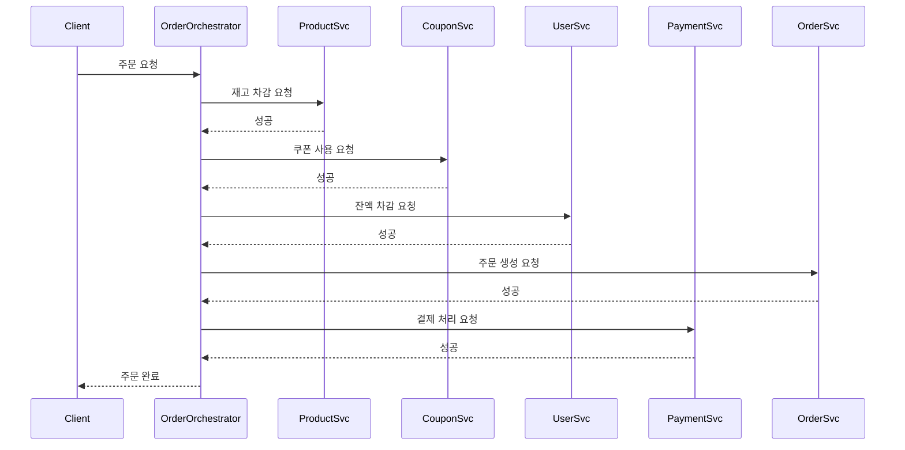
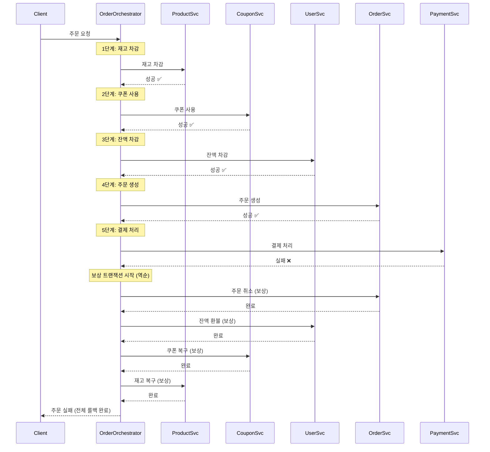

# STEP 16: 트랜잭션 분리에 따른 문제 진단 및 해결 방안

## 📋 목차
1. [현재 시스템 분석](#1-현재-시스템-분석)
2. [MSA 전환 시나리오](#2-msa-전환-시나리오)
3. [트랜잭션 분리 시 발생하는 문제](#3-트랜잭션-분리-시-발생하는-문제)
4. [해결 방안: 분산 트랜잭션 패턴](#4-해결-방안-분산-트랜잭션-패턴)
5. [최종 아키텍처 설계](#5-최종-아키텍처-설계)

---

## 1. 현재 시스템 분석

### 1.1 모놀리식 아키텍처

현재 이커머스 시스템은 모든 도메인이 하나의 애플리케이션과 하나의 데이터베이스로 구성되어 있다.

```
┌─────────────────────────────────────────┐
│       E-Commerce Application            │
│                                          │
│  ┌──────────┐  ┌──────────┐            │
│  │  Order   │  │ Product  │            │
│  │ Service  │  │ Service  │            │
│  └──────────┘  └──────────┘            │
│                                          │
│  ┌──────────┐  ┌──────────┐            │
│  │ Payment  │  │  Coupon  │            │
│  │ Service  │  │ Service  │            │
│  └──────────┘  └──────────┘            │
│                                          │
│  ┌──────────┐                           │
│  │   User   │                           │
│  │ Service  │                           │
│  └──────────┘                           │
└─────────────┬───────────────────────────┘
              │
              ▼
      ┌───────────────┐
      │   MySQL DB    │
      │               │
      │ - orders      │
      │ - products    │
      │ - payments    │
      │ - coupons     │
      │ - users       │
      └───────────────┘
```

### 1.2 현재 주문 프로세스의 트랜잭션 범위

**주문 생성 시 하나의 트랜잭션으로 처리되는 작업들:**

```java
@Transactional
public OrderResponse createOrder(CreateOrderRequest request) {
    // 1. 사용자 검증
    User user = userRepository.findById(userId);

    // 2. 재고 차감 (Product)
    product.decreaseStock(quantity);

    // 3. 쿠폰 사용 처리 (Coupon)
    if (couponId != null) {
        coupon.use();
    }

    // 4. 잔액 차감 (User Balance)
    user.decreaseBalance(finalAmount);

    // 5. 주문 생성 (Order)
    Order order = Order.create(...);

    // 6. 결제 정보 저장 (Payment)
    Payment payment = Payment.create(...);

    return OrderResponse.from(order);
}
```

**장점:**
- 모든 작업이 하나의 트랜잭션 → ACID 보장
- 일부 실패 시 전체 롤백 → 데이터 일관성 유지
- 구현이 단순함

**단점:**
- 모든 도메인이 강하게 결합
- 한 도메인의 장애가 전체 시스템에 영향
- 확장성 제한 (수직 확장만 가능)
- 배포 단위가 크고, 배포 시 전체 서비스 중단 필요

---

## 2. MSA 전환 시나리오

### 2.1 도메인별 서비스 분리

비즈니스 확장에 따라 다음과 같이 도메인별로 서비스를 분리한다.

```
┌──────────────────┐   ┌──────────────────┐   ┌──────────────────┐
│  Order Service   │   │ Product Service  │   │ Payment Service  │
│                  │   │                  │   │                  │
│  - 주문 생성      │   │  - 재고 관리      │   │  - 결제 처리      │
│  - 주문 조회      │   │  - 상품 조회      │   │  - 결제 내역      │
│  - 주문 상태 관리 │   │  - 인기 상품      │   │                  │
└────────┬─────────┘   └────────┬─────────┘   └────────┬─────────┘
         │                      │                      │
         ▼                      ▼                      ▼
   ┌──────────┐          ┌──────────┐          ┌──────────┐
   │ Order DB │          │Product DB│          │Payment DB│
   └──────────┘          └──────────┘          └──────────┘

┌──────────────────┐   ┌──────────────────┐
│  Coupon Service  │   │   User Service   │
│                  │   │                  │
│  - 쿠폰 발급      │   │  - 사용자 관리    │
│  - 쿠폰 사용      │   │  - 잔액 관리      │
│  - 쿠폰 조회      │   │                  │
└────────┬─────────┘   └────────┬─────────┘
         │                      │
         ▼                      ▼
   ┌──────────┐          ┌──────────┐
   │ Coupon DB│          │ User DB  │
   └──────────┘          └──────────┘
```

### 2.2 서비스별 책임과 데이터

| 서비스 | 책임 | 주요 데이터 |
|--------|------|------------|
| **Order Service** | 주문 생성, 조회, 상태 관리 | Order, OrderItem |
| **Product Service** | 상품 관리, 재고 관리, 인기 상품 집계 | Product, Stock |
| **Payment Service** | 결제 처리, 결제 내역 관리 | Payment |
| **Coupon Service** | 쿠폰 발급, 사용, 검증 | Coupon, UserCoupon |
| **User Service** | 사용자 관리, 잔액 관리 | User, Balance |

---

## 3. 트랜잭션 분리 시 발생하는 문제

### 3.1 문제 상황: 분산 트랜잭션의 ACID 깨짐

모놀리식에서는 하나의 트랜잭션으로 처리되던 주문 프로세스가, MSA에서는 **5개의 독립적인 트랜잭션**으로 분리된다.

```
[Before - 모놀리식]
┌─────────────────────────────────────────────────┐
│         @Transactional (단일 트랜잭션)            │
│                                                 │
│  재고 차감 → 쿠폰 사용 → 잔액 차감 → 주문 생성 → 결제  │
│                                                 │
│  ✅ 전체 성공 또는 전체 롤백                       │
└─────────────────────────────────────────────────┘

[After - MSA]
┌──────────────┐  ┌──────────────┐  ┌──────────────┐  ┌──────────────┐  ┌──────────────┐
│   재고 차감   │  │   쿠폰 사용   │  │   잔액 차감   │  │   주문 생성   │  │   결제 처리   │
│ (Product DB) │  │ (Coupon DB)  │  │  (User DB)   │  │  (Order DB)  │  │ (Payment DB) │
│              │  │              │  │              │  │              │  │              │
│  TX1 ✅      │  │  TX2 ✅      │  │  TX3 ✅      │  │  TX4 ✅      │  │  TX5 ❌      │
└──────────────┘  └──────────────┘  └──────────────┘  └──────────────┘  └──────────────┘

❌ 문제: 결제만 실패했는데, 재고/쿠폰/잔액은 이미 처리됨!
```

### 3.2 구체적인 장애 시나리오

#### 시나리오 1: 결제 서비스 장애

```
1. Product Service: 재고 차감 성공 ✅
2. Coupon Service: 쿠폰 사용 성공 ✅
3. User Service: 잔액 차감 성공 ✅
4. Order Service: 주문 생성 성공 ✅
5. Payment Service: 타임아웃 ❌ (서버 장애)

결과:
- 재고는 차감됨 (다른 사용자가 구매 못함)
- 쿠폰은 사용됨 (다시 못 씀)
- 잔액은 차감됨 (돈은 빠져나감)
- 주문은 생성됨 (주문 내역에 보임)
- 하지만 결제 기록 없음!

💥 데이터 불일치 발생
```

#### 시나리오 2: 중간 단계 실패

```
1. Product Service: 재고 차감 성공 ✅
2. Coupon Service: 쿠폰 사용 성공 ✅
3. User Service: 잔액 부족 ❌

문제:
- 재고와 쿠폰은 이미 처리됨
- 잔액 부족으로 주문 실패
- 재고와 쿠폰을 복구해야 하는데 어떻게?

💥 일부만 성공한 상태로 남음
```

#### 시나리오 3: 네트워크 지연으로 인한 타임아웃

```
1. Product Service: 재고 차감 요청 → 타임아웃 ❌
   (실제로는 성공했지만 응답을 못 받음)

Order Service 입장:
- 재고 차감 실패로 판단
- 주문 생성 중단

실제 상황:
- 재고는 차감됨 (DB에 반영됨)
- 하지만 주문은 생성 안 됨

💥 재고만 차감되고 주문 없음 (유령 재고 차감)
```

### 3.3 문제 정리

| 문제 유형 | 설명 | 예시 |
|----------|------|------|
| **부분 실패** | 일부 서비스는 성공, 일부는 실패 | 재고O, 쿠폰O, 결제X |
| **네트워크 타임아웃** | 실제론 성공했으나 응답 못 받음 | 재고 차감 성공 but 응답 X |
| **순서 보장 실패** | 서비스 호출 순서가 보장 안 됨 | 결제 먼저, 재고 차감 나중 |
| **보상 실패** | 롤백 시도 중 추가 실패 발생 | 재고 복구 시도 중 실패 |
| **데이터 정합성** | 서비스 간 데이터 불일치 | 주문 상태 != 결제 상태 |

---

## 4. 해결 방안: 분산 트랜잭션 패턴

### 4.1 SAGA 패턴 선택

분산 환경에서 트랜잭션 일관성을 보장하기 위해 **SAGA 패턴**을 적용한다.

**SAGA 패턴이란?**
- 긴 트랜잭션을 여러 개의 작은 로컬 트랜잭션으로 분리
- 각 로컬 트랜잭션은 독립적으로 커밋
- 실패 시 이전 단계를 **보상(compensate)**하여 롤백

### 4.2 Choreography vs Orchestration

#### 방식 1: Choreography (이벤트 기반)

각 서비스가 이벤트를 발행하고 구독하여 자율적으로 동작

```
Order Service → [OrderCreated 이벤트 발행]
                       ↓
         ┌─────────────┼─────────────┬─────────────┐
         ▼             ▼             ▼             ▼
   Product Svc   Coupon Svc     User Svc    Payment Svc
   (재고 차감)    (쿠폰 사용)    (잔액 차감)   (결제 처리)
         │             │             │             │
         └─────────────┴─────────────┴─────────────┘
                       ↓
              [각자 성공/실패 이벤트 발행]
                       ↓
              Order Service가 수집하여 최종 판단
```

**장점:**
- 서비스 간 결합도 낮음
- 확장성 좋음

**단점:**
- 전체 흐름 파악 어려움
- 디버깅 복잡함
- 순환 의존 위험

#### 방식 2: Orchestration (중앙 조정)

**오케스트레이터(Orchestrator)**가 전체 흐름을 제어

```
                ┌──────────────────────┐
                │ Order Orchestrator   │
                │  (주문 조정자)        │
                └──────────┬───────────┘
                           │
         ┌─────────────────┼─────────────────┬─────────────┐
         ▼                 ▼                 ▼             ▼
   1. Product Svc    2. Coupon Svc     3. User Svc   4. Payment Svc
      재고 차감          쿠폰 사용          잔액 차감       결제 처리
         │                 │                 │             │
         └─────────────────┴─────────────────┴─────────────┘
                           │
                      [결과 수집]
                           │
                    Orchestrator가
                    성공/실패 판단 및
                    보상 트랜잭션 실행
```

**장점:**
- 전체 흐름 명확
- 디버깅 쉬움
- 보상 로직 중앙 관리

**단점:**
- Orchestrator가 단일 장애점
- 서비스 간 결합도 증가

**🎯 선택: Orchestration 방식 채택**

이유:
- 주문 프로세스는 명확한 순서가 있음
- 전체 흐름을 제어하고 싶음
- 보상 로직을 중앙에서 관리하는 게 더 안전

### 4.3 보상 트랜잭션 설계

각 단계마다 **보상(Compensating) 트랜잭션**을 정의한다.

| 단계 | 정상 트랜잭션 | 보상 트랜잭션 |
|------|--------------|--------------|
| 1. 재고 차감 | `decreaseStock()` | `increaseStock()` (재고 복구) |
| 2. 쿠폰 사용 | `useCoupon()` | `restoreCoupon()` (쿠폰 복구) |
| 3. 잔액 차감 | `decreaseBalance()` | `increaseBalance()` (잔액 환불) |
| 4. 주문 생성 | `createOrder()` | `cancelOrder()` (주문 취소) |
| 5. 결제 처리 | `processPayment()` | `refundPayment()` (결제 취소) |

**보상 실행 순서:** 역순으로 실행

```
정상 흐름: 1 → 2 → 3 → 4 → 5
실패 시:   5단계 실패 → 4 보상 → 3 보상 → 2 보상 → 1 보상
```

---

## 5. 최종 아키텍처 설계

### 5.1 주문 프로세스 SAGA 구현

#### 5.1.1 정상 흐름



#### 5.1.2 실패 및 보상 흐름

**시나리오: 결제 단계에서 실패**



### 5.2 Orchestrator 구현 예시 (의사 코드)

```java
@Service
public class OrderOrchestrator {

    private final ProductServiceClient productClient;
    private final CouponServiceClient couponClient;
    private final UserServiceClient userClient;
    private final OrderServiceClient orderClient;
    private final PaymentServiceClient paymentClient;

    public OrderResult executeOrder(OrderRequest request) {
        List<CompensationAction> compensations = new ArrayList<>();

        try {
            // 1단계: 재고 차감
            productClient.decreaseStock(request.getProductId(), request.getQuantity());
            compensations.add(() -> productClient.increaseStock(request.getProductId(), request.getQuantity()));

            // 2단계: 쿠폰 사용
            if (request.getCouponId() != null) {
                couponClient.useCoupon(request.getCouponId());
                compensations.add(() -> couponClient.restoreCoupon(request.getCouponId()));
            }

            // 3단계: 잔액 차감
            userClient.decreaseBalance(request.getUserId(), request.getFinalAmount());
            compensations.add(() -> userClient.increaseBalance(request.getUserId(), request.getFinalAmount()));

            // 4단계: 주문 생성
            String orderId = orderClient.createOrder(request);
            compensations.add(() -> orderClient.cancelOrder(orderId));

            // 5단계: 결제 처리
            paymentClient.processPayment(orderId, request.getFinalAmount());

            return OrderResult.success(orderId);

        } catch (Exception e) {
            // 보상 트랜잭션 실행 (역순)
            executeCompensations(compensations);
            return OrderResult.failure(e.getMessage());
        }
    }

    private void executeCompensations(List<CompensationAction> compensations) {
        // 역순으로 보상 실행
        Collections.reverse(compensations);

        for (CompensationAction compensation : compensations) {
            try {
                compensation.execute();
            } catch (Exception e) {
                // 보상 실패 시 로그 남기고 계속 진행
                // 실무에서는 Dead Letter Queue나 관리자 알림 필요
                log.error("보상 트랜잭션 실패", e);
            }
        }
    }
}
```

### 5.3 멱등성(Idempotency) 보장

네트워크 타임아웃으로 인한 중복 요청을 방지하기 위해 멱등성을 보장한다.

**방법: 멱등성 키(Idempotency Key) 사용**

```java
@RestController
public class OrderController {

    @PostMapping("/orders")
    public OrderResponse createOrder(
        @RequestBody OrderRequest request,
        @RequestHeader("Idempotency-Key") String idempotencyKey
    ) {
        // 1. 이미 처리된 요청인지 확인
        Optional<OrderResult> cached = cacheService.get(idempotencyKey);
        if (cached.isPresent()) {
            return cached.get(); // 이전 결과 반환
        }

        // 2. 새로운 요청 처리
        OrderResult result = orchestrator.executeOrder(request);

        // 3. 결과 캐싱 (24시간)
        cacheService.put(idempotencyKey, result, Duration.ofHours(24));

        return result;
    }
}
```

### 5.4 최종 아키텍처 다이어그램

```
                          ┌─────────────────┐
                          │     Client      │
                          └────────┬────────┘
                                   │
                          [Idempotency-Key]
                                   │
                                   ▼
                    ┌──────────────────────────┐
                    │   Order Orchestrator     │
                    │  (SAGA 조정자)            │
                    │                          │
                    │  - 트랜잭션 순서 제어     │
                    │  - 보상 로직 관리         │
                    │  - 멱등성 보장           │
                    └─────────┬────────────────┘
                              │
         ┌────────────────────┼────────────────────┬───────────────┐
         │                    │                    │               │
         ▼                    ▼                    ▼               ▼
    ┌─────────┐          ┌─────────┐         ┌─────────┐     ┌──────────┐
    │ Product │          │ Coupon  │         │  User   │     │ Payment  │
    │ Service │          │ Service │         │ Service │     │ Service  │
    └────┬────┘          └────┬────┘         └────┬────┘     └─────┬────┘
         │                    │                    │                │
         ▼                    ▼                    ▼                ▼
    ┌─────────┐          ┌─────────┐         ┌─────────┐     ┌──────────┐
    │Product  │          │ Coupon  │         │  User   │     │ Payment  │
    │   DB    │          │   DB    │         │   DB    │     │    DB    │
    └─────────┘          └─────────┘         └─────────┘     └──────────┘

    각 서비스는 로컬 트랜잭션 관리
    Orchestrator는 전체 흐름 조정
```

---

## 6. 추가 고려 사항

### 6.1 보상 트랜잭션 실패 시 대응

**문제:** 보상 트랜잭션도 실패할 수 있다.

**해결 방안:**

1. **재시도(Retry) 메커니즘**
   ```java
   @Retry(maxAttempts = 3, backoff = @Backoff(delay = 1000))
   public void compensate() {
       // 보상 로직
   }
   ```

2. **Dead Letter Queue**
   - 최종 실패한 보상 요청을 별도 큐에 저장
   - 관리자가 수동으로 처리하거나, 배치로 재시도

3. **알림 시스템**
   - 보상 실패 시 즉시 관리자에게 알림
   - Slack, 이메일 등

### 6.2 이벤트 소싱(Event Sourcing) 도입 검토

모든 상태 변경을 이벤트로 저장하여 추적성을 높인다.

```java
// 이벤트 저장소
- OrderCreatedEvent
- StockDecreasedEvent
- CouponUsedEvent
- BalanceDecreasedEvent
- PaymentProcessedEvent
- OrderCancelledEvent (보상)
```

**장점:**
- 전체 흐름 추적 가능
- 재현 가능
- 감사(Audit) 로그

### 6.3 모니터링 및 알림

분산 환경에서는 모니터링이 필수다.

**모니터링 항목:**
- 각 단계별 성공률
- 보상 트랜잭션 실행 횟수
- 평균 처리 시간
- 타임아웃 발생 빈도

**도구:**
- Prometheus + Grafana
- ELK Stack
- Distributed Tracing (Zipkin, Jaeger)

---

## 7. 결론

### 7.1 MSA 전환 후 달라지는 점

| 항목 | 모놀리식 | MSA (SAGA 적용) |
|------|----------|----------------|
| **트랜잭션** | 단일 ACID 트랜잭션 | 분산 트랜잭션 (최종 일관성) |
| **일관성** | 강한 일관성 | 최종 일관성 (Eventual Consistency) |
| **실패 처리** | 자동 롤백 | 보상 트랜잭션 필요 |
| **복잡도** | 낮음 | 높음 (보상 로직, 멱등성 등) |
| **확장성** | 제한적 | 높음 (서비스별 독립 확장) |
| **장애 격리** | 불가능 | 가능 (한 서비스 장애가 전체에 영향 X) |

### 7.2 트레이드오프

**얻는 것:**
- 서비스별 독립적인 배포
- 수평 확장 가능
- 기술 스택 자유도
- 장애 격리

**잃는 것:**
- 단순함 (복잡도 증가)
- 강한 일관성 보장
- 개발 및 운영 난이도 증가

### 7.3 권장 사항

1. **점진적 전환**
   - 한 번에 모든 서비스를 분리하지 말고, 점진적으로 전환
   - 예: Order → Payment 분리 → 안정화 → Product 분리 ...

2. **충분한 테스트**
   - 각종 실패 시나리오 테스트 필수
   - Chaos Engineering 도입 검토

3. **명확한 도메인 경계**
   - Bounded Context를 명확히 정의
   - 서비스 간 의존성 최소화

4. **운영 자동화**
   - CI/CD 파이프라인 구축
   - 모니터링 및 알림 시스템 필수

이 설계를 바탕으로 안정적인 MSA 전환이 가능하다.
