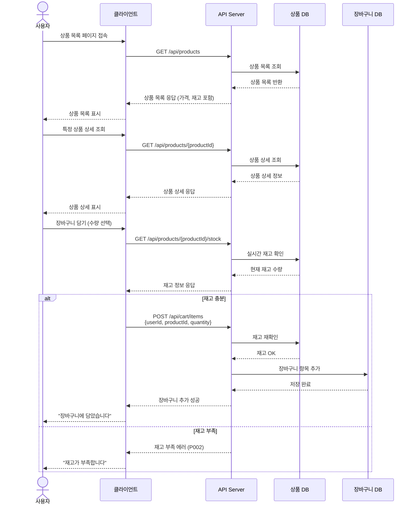
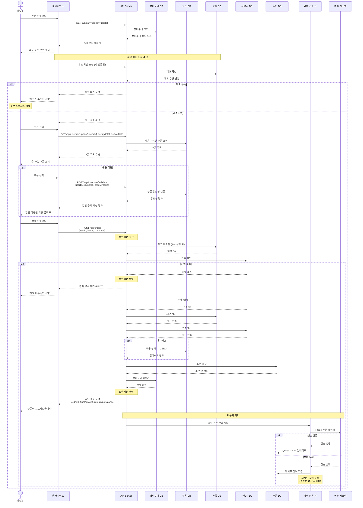
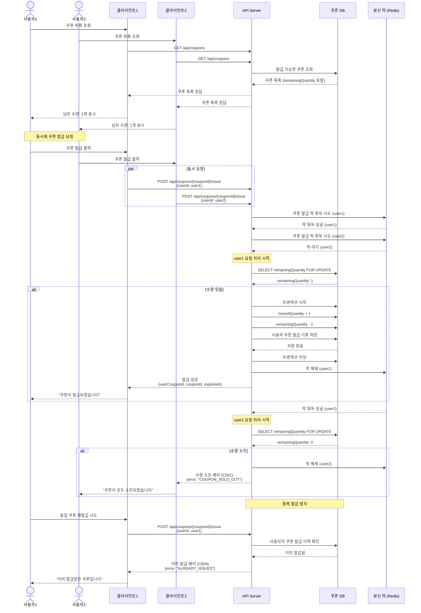
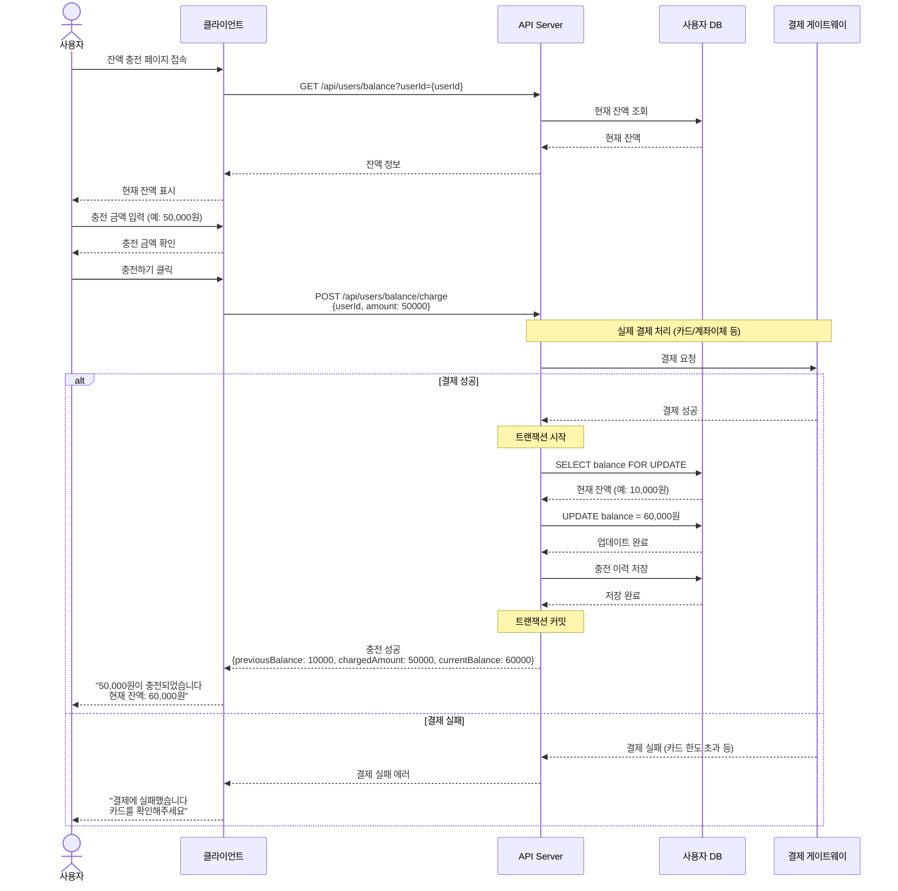
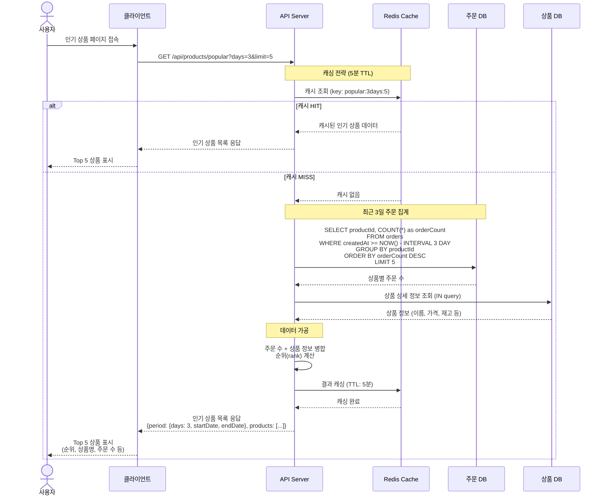
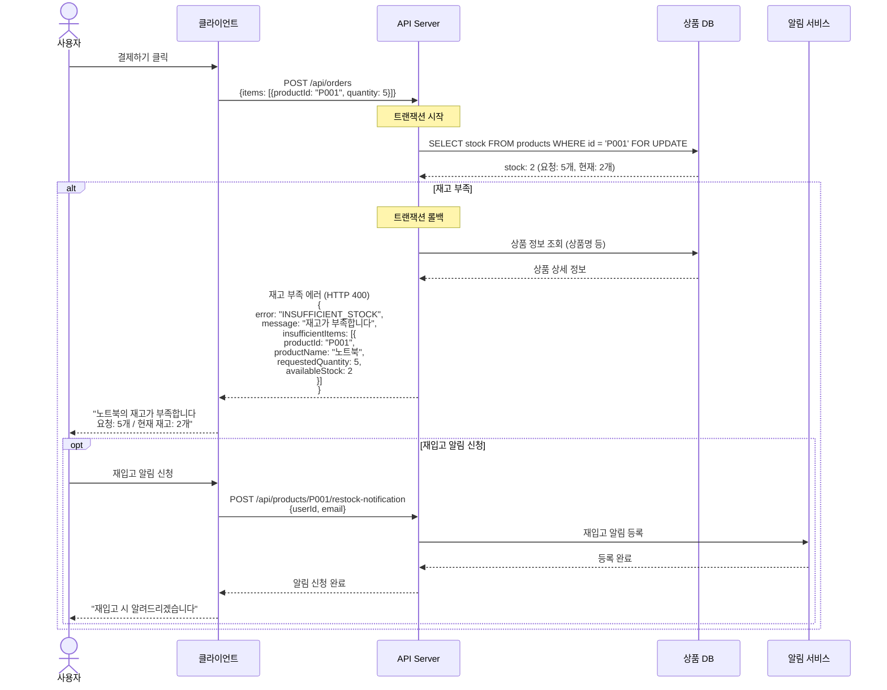
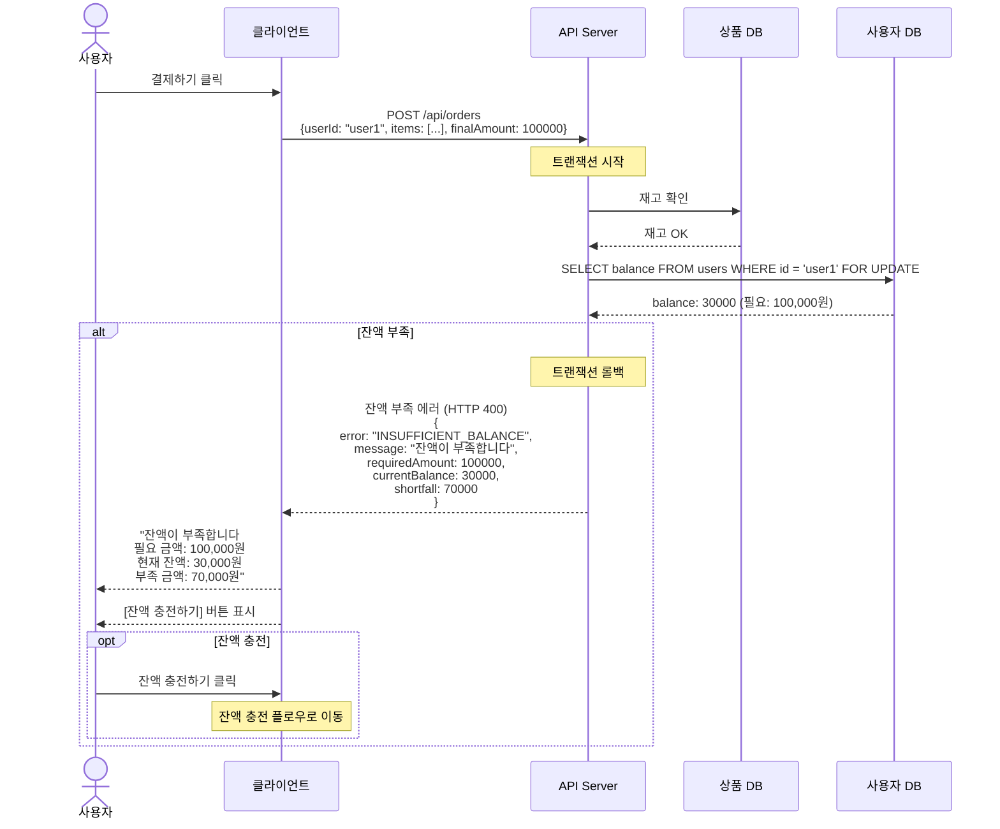
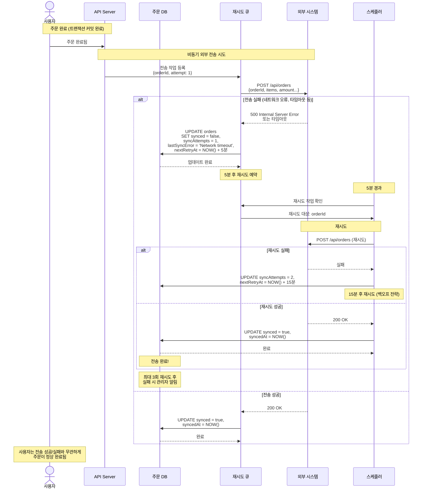

# 이커머스 시퀀스 다이어그램

## 1. 상품 조회 및 장바구니 담기

---

## 2. 주문 및 결제 플로우

---

## 3. 쿠폰 선착순 발급

---

## 4. 잔액 충전 플로우

---

## 5. 인기 상품 조회 (최근 3일 Top 5)

---

## 6. 예외 처리 시나리오

### 6.1 재고 부족 상세 처리

### 6.2 잔액 부족 상세 처리

### 6.3 외부 전송 실패 및 재시도

---

## 다이어그램 설명

### 1. 상품 조회 및 장바구니 담기
- 상품 목록/상세 조회 시 재고 정보 포함
- 장바구니 담기 전 실시간 재고 확인
- 재고 부족 시 에러 처리

### 2. 주문 및 결제 플로우
- 장바구니 조회 → 재고 확인 → 쿠폰 선택 → 주문 생성
- 재고/잔액 검증 후 차감 (트랜잭션)
- 외부 시스템 전송은 비동기 처리
- **중요**: 외부 전송 실패해도 주문은 정상 처리

### 3. 쿠폰 선착순 발급
- 동시성 제어 (분산 락 사용)
- 선착순 발급 (remainingQuantity 차감)
- 중복 발급 방지
- 수량 소진 시 에러 처리

### 4. 잔액 충전 플로우
- 결제 게이트웨이 연동
- 트랜잭션으로 잔액 업데이트
- 충전 이력 저장
- 결제 실패 시 에러 처리

### 5. 인기 상품 조회
- Redis 캐싱 전략 (5분 TTL)
- 최근 N일 주문 데이터 집계
- 상품 정보 병합 및 순위 계산
- 성능 최적화

### 6. 예외 처리 시나리오
- **재고 부족**: 상세 에러 정보 제공, 재입고 알림 옵션
- **잔액 부족**: 부족 금액 표시, 충전 유도
- **외부 전송 실패**: 재시도 큐 등록, 백오프 전략, 최대 3회 재시도
